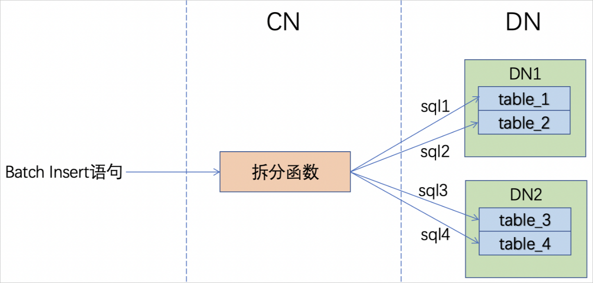

如何优化Batch Insert 
=====================================

Batch Insert语句是常见的数据库写入数据的方式，PolarDB-X兼容MySQL协议和语法，Batch Insert语法为：

```sql
INSERT [IGNORE] [INTO] table_name(column_name, ...) VALUES (value1, ...), (value2, ...), ...;
```


影响Batch Insert性能的主要因素包括：

1. batch size

2. 并行度

3. 分片数目

4. 列数目

5. GSI的数目

6. sequence数目


对于分片数目、列数目、GSI数目、sequence数目等内需因素，根据实际需求进行设置，并且常常会和读性能相互影响，例如GSI数目较多情况下，写入性能肯定会下降，但是对读性能有提升。本文不详细讨论这些因素的影响，主要聚焦于batch size和并行度的合理设置。

测试环境 
-------------------------

本文档的测试环境见下表：


|     环境      |                       参数                        |
|-------------|-------------------------------------------------|
| PolarDB-X版本 | polarx-kernel_5.4.11-16279028_xcluster-20210802 |
| 节点规格        | 16核64GB                                         |
| 节点个数        | 4                                               |


测试的表用例：

```sql
CREATE TABLE `sbtest1` (
    `id` int(11) NOT NULL,
    `k` int(11) NOT NULL DEFAULT '0',
    `c` char(120) NOT NULL DEFAULT '',
    `pad` char(60) NOT NULL DEFAULT '',
    PRIMARY KEY (`id`),
    KEY `k_1` (`k`)
) ENGINE = InnoDB DEFAULT CHARSET = utf8mb4;
```


Batch特性：BATCH_INSERT_POLICY=SPLIT 
------------------------------------------------------

PolarDB-X针对数据批量写入，为保障更好的并发性，对Batch Insert进行了优化，当单个Batch Insert语句大小超过256K时，PolarDB-X会将Batch Insert语句动态拆分成多个小Batch，多个小Batch之间串行执行，这个特性称为SPLIT。

通过BATCH_INSERT_POLICY=SPLIT的机制，在保障最佳性能的同时，减少PolarDB-X并行执行Batch Insert的代价，尽可能规避分布式下多节点的负载不均衡。

相关参数：

1. BATCH_INSERT_POLICY，可选SPLIT/NONE，默认值为SPLIT，代表默认启用动态拆分Batch。

2. MAX_BATCH_INSERT_SQL_LENGTH，默认值256，单位KB。代表触发动态拆分Batch的SQL长度阈值为256K。

3. BATCH_INSERT_CHUNK_SIZE_DEFAULT，默认值200。代表触发动态拆分Batch时，每个拆分之后的小Batch的批次大小。


关闭BATCH_INSERT_POLICY=SPLIT机制，可通过如下hint语句`/*+TDDL:CMD_EXTRA(BATCH_INSERT_POLICY=NONE)*/ `。 此参数的目标是关闭BATCH_INSERT_POLICY策略，这样才可以保证batch size在PolarDB-X执行时不做自动拆分，可用于验证batch size为2000、5000、10000下的性能，从测试的结果来看batch size超过1000以后提升并不明显。

单表的性能基准 
----------------------------

在分布式场景下单表只会在一个主机上，其性能可以作为一个基础的性能基线，用于评测分区表的水平扩展的能力，分区表会将数据均匀分布到多台主机上。

测试方法为对PolarDB-X中的单表进行Batch Insert操作，单表的数据只会存在一个数据存储节点中，PolarDB-X会根据表定义将数据写入到对应的数据存储节点上。

**场景一：batch size**

参数配置：

* 并行度：16

* 列：4

* gsi：无

* sequence：无


|      测试项      | batch size |  1   |  10   |  100   |  500   |  1000  |  2000  |  5000  | 10000  |
|---------------|------------|------|-------|--------|--------|--------|--------|--------|--------|
| PolarDB-X【单表】 | 性能（行每秒）    | 5397 | 45653 | 153216 | 211976 | 210644 | 215103 | 221919 | 220529 |


**场景二：并行度**

参数配置：

* batch size：1000

* 列：4

* gsi：无

* sequence：无


|      测试项      | thread  |   1   |   2   |   4   |   8    |   16   |   32   |   64   |  128   |
|---------------|---------|-------|-------|-------|--------|--------|--------|--------|--------|
| PolarDB-X【单表】 | 性能（行每秒） | 22625 | 41326 | 76052 | 127646 | 210644 | 223431 | 190138 | 160858 |

 **测试总结**

对于单表的测试，推荐batch size为1000，并行度为16\~32时整体性能比较好。在测试batch size为2000、5000、10000时，需要添加hint参数来关闭SPLIT特性，从测试的结果来看batch size超过1000以后提升并不明显。示例：

```sql
/*+TDDL:CMD_EXTRA(BATCH_INSERT_POLICY=NONE)*/
```


分区表的性能基准 
-----------------------------

Batch size和并行度都会影响Batch Insert的性能，下面对这两个因素分开进行测试分析。

**场景一：batch Size**

在数据分片的情况下，由于包含拆分函数，Batch Insert语句会经过拆分函数分离values，下推到物理存储上的batch size会改变，示意图如下图所示。



所以数据分片下，PolarDB-X的Batch Insert语句可以更大一些，或者尽量将同一个物理表的数据放到一个Batch Insert语句中，保证拆分函数分离values后下推到单个数据分片上的batch size较合适，以提升存储节点的性能。

* 子场景一 (BATCH_INSERT_POLICY=SPLIT)参数配置：

  * BATCH_INSERT_POLICY：开启
  
  * 并行度：32
  
  * 分片数：32
  
  * 列：4
  
  * gsi：无
  
  * sequence：无
  

  

  

  |      测试项      | batch size |   1   |  10   |  100   |  500   |  1000  |  2000  |  5000  | 10000  |
  |---------------|------------|-------|-------|--------|--------|--------|--------|--------|--------|
  | PolarDB-X【单表】 | 性能（行每秒）    | 12804 | 80987 | 229995 | 401215 | 431579 | 410120 | 395398 | 389176 |

  
  **说明** batch size \>= 2000时，会触发BATCH_INSERT_POLICY策略。
  

* 子场景二 (BATCH_INSERT_POLICY=NONE)参数配置：

  * BATCH_INSERT_POLICY：关闭
  
  * 并行度：32
  
  * 分片数：32
  
  * 列：4
  
  * gsi：无
  
  * sequence：无
  

  

  
  

  |        测试项        | batch size |  1000  |  2000  |  5000  | 10000  | 20000  | 30000  | 50000  |
  |-------------------|------------|--------|--------|--------|--------|--------|--------|--------|
  | PolarDB-X【分片数：32】 | 性能（行每秒）    | 431579 | 463112 | 490350 | 526751 | 549990 | 595026 | 685500 |

  

  总结：
  1. `BATCH_INSERT_POLICY=SPLIT`，batch size为1000，整体性能为每秒43w行，相当于单表的两倍；
  
  2. `BATCH_INSERT_POLICY=NODE`，本测试的values是随机分布，拆分函数是Hash，所以分布到每个分片上的数据基本均匀，理论情况下分片数×1000的batch size下性能会比较好，在最大batch size为50000时，整体性能为每秒68万行。
  

  

  


 **场景二：并行度**

判断并行度合适的标准是将PolarDB-X数据节点的CPU利用率压满或将IOPS打满，以达到较好性能，因为Batch Insert语句基本无计算，所以PolarDB-X计算节点开销不大，主要开销在PolarDB-X数据节点。并行度过小或者过大都会影响性能，影响并行度的值的因素：节点个数、节点规格（核数和CPU）、线程池压力等，所以并行度很难得出一个确切的数字，推荐通过实践环境进行测试，找出适合该环境的最佳并行度。

* 子场景一：测试4节点下，batch size为1000的不同并行度。参数配置：

  * batch size：1000
  
  * 列：4
  
  * gsi：无
  
  * sequence：无
  

  

  |        测试项        | thread  |   1   |   2   |   4    |   8    |   16   |   32   |   64   |   80   |   96   |
  |-------------------|---------|-------|-------|--------|--------|--------|--------|--------|--------|--------|
  | PolarDB-X【分片数：32】 | 性能（行每秒） | 40967 | 80535 | 151415 | 246062 | 367720 | 431579 | 478876 | 499918 | 487173 |

  

  总结：该配置下，64～80并发时性能达到峰值，大概50w行每秒。
  

* 子场景二：不同节点个数下的并行度测试参数配置：

  * 2节点：2CN×2DN
  
  * batch size：20000
  
  * 列：4
  
  * gsi：无
  
  * sequence：无
  

  

  |        测试项        | thread  |   4    |   8    |   12   |   16   |
  |-------------------|---------|--------|--------|--------|--------|
  | PolarDB-X【分片数：16】 | 性能（行每秒） | 159794 | 302754 | 296298 | 241444 |

  

  参数配置：
  * 3节点：3CN×3DN
  
  * batch size：20000
  
  * 列：4
  
  * gsi：无
  
  * sequence：无
  

  

  |        测试项        | thread  |   9    |   12   |   15   |   18   |
  |-------------------|---------|--------|--------|--------|--------|
  | PolarDB-X【分片数：24】 | 性能（行每秒） | 427212 | 456050 | 378420 | 309052 |

  

  参数配置：
  * 4节点：4CN×4DN
  
  * batch size：20000
  
  * 列：4
  
  * gsi：无
  
  * sequence：无
  

  

  |        测试项        | thread  |   16   |   32   |   40   |   64   |
  |-------------------|---------|--------|--------|--------|--------|
  | PolarDB-X【分片数：32】 | 性能（行每秒） | 464612 | 549990 | 551992 | 373268 |

  

  总结：节点数增加，最佳性能的并行度也需要增大。2节点下峰值为8并发30万、3节点下峰值为12并发45万、4节点下峰值为32并发55万，整体随着节点数的性能提升线性率为0.9\~1左右。
  

* 子场景三：不同节点规格下的并行度测试参数配置：

  * batch size：20000
  
  * 列：4
  
  * gsi：无
  
  * sequence：无
  

  

  |        测试项        | thread  |   4    |   8    |   10   |   12   |   16   |
  |-------------------|---------|--------|--------|--------|--------|--------|
  | PolarDB-X【4核16GB】 | 性能（行每秒） | 165674 | 288828 | 276837 | 264873 | 204738 |

  

  |        测试项        | thread  |   8    |   10   |   12   |   16   |
  |-------------------|---------|--------|--------|--------|--------|
  | PolarDB-X【8核32GB】 | 性能（行每秒） | 292780 | 343498 | 315982 | 259892 |

  

  |        测试项         | thread  |   16   |   32   |   40   |   64   |
  |--------------------|---------|--------|--------|--------|--------|
  | PolarDB-X【16核64GB】 | 性能（行每秒） | 464612 | 549990 | 551992 | 373268 |

  

  总结：节点规格升级，最佳性能的并行度也需要增大。4核16GB下峰值为8并发28w、8核32GB下峰值为10并发34w、16核64GB下峰值为32并发55w，整体随着节点规格的性能提升线性率为0.5\~0.6左右。
  


测试总结 
-------------------------

* 默认情况下，batch size建议为1000，并发度建议16\~32并发，整体实例的并发性能和资源负载会比较优。

* 追求数据批量导入的最大速度，可增大batch size，建议batch size = 分片数 \* \[100\~1000\]，比如20000\~50000。对应的单条Batch语句的大小控制2MB～8MB（默认最大包大小为16MB），同时需要通过hint设置BATCH_INSERT_POLICY=NONE。注意点：单条sql语句过大时，分布式下单个计算节点的压力会偏重，首先会带来一定的内存消耗风险，其次可能会出现多个节点之间的压力不均衡。

* Batch的批量导入，消耗更多的是IOPS的资源，CPU/MEM不是主要瓶颈。因此，如果需要做资源升配来提升性能时，可以优先考虑扩容节点数，其次再考虑升配单节点规格。

* 线下文本数据的批量导入，建议使用PolarDB-X配套的导入导出工具Batch Tool，请参见[使用Batch Tool工具导入导出数据](../../tools/topics/batch-tool.md)。


