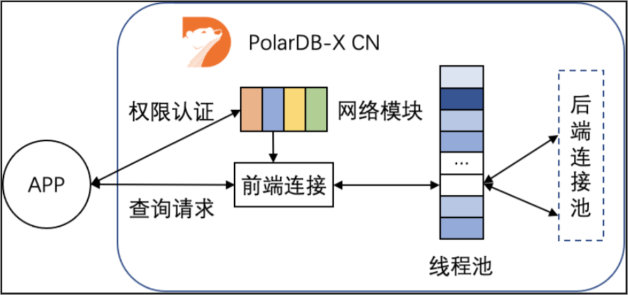

如何选择应用端链接池 
===============================

背景 
-----------------------

当应用程序连接PolarDB-X实例执行操作时，从PolarDB-X实例的角度看，会有如下两种类型的连接：

* 前端连接：由应用程序建立的，到PolarDB-X计算节点（CN）中逻辑库的连接。

* 后端连接：由PolarDB-X计算节点建立的，到后端数据节点（DN）中物理库的连接。


其中后端连接由CN管理，通过私有协议实现TCP连接与后端连接解绑，对用户透明。前端连接由用户创建和管理，本文主要讨论前端连接管理的最佳实践。

**说明** 为了简化描述，下文中的 "连接" 均代指 "前端连接"。

QPS/RT与连接数的关系 
----------------------------------

每秒查询请求数 (Query Per Second，QPS) 和响应时间 (Response Time，RT) 是衡量应用对数据库性能需求的基本指标，QPS代表应用并发访问数据库的需求，RT代表单条语句的处理性能。RT的高低与执行的SQL是否复杂和扫描的数据量紧密相关，OLTP系统中查询RT较低，通常以毫秒为单位。

PolarDB-X兼容MySQL协议，请求在单个连接上串行执行，不同连接上的请求可以并行执行，由此得到以下公式：

* 单个连接的QPS上限 = 1000/RT

* 应用访问单个CN的QPS上限 = 单个连接的QPS上限×连接数


按照平均RT为5ms计算，单个连接的QPS上限为200，假设应用预估需要的QPS为5000，则至少需要建立25个连接。

连接数限制 
--------------------------

PolarDB-X中前端连接仅与网络连接绑定，连接的数量理论上仅受限于CN可用的内存大小和网络连接数。但在实际的场景中，应用创建连接是为了执行查询，连接数需要与执行线程的数量相匹配才能达到最佳性能。



如上图所示，应用发起连接请求后，首先由网络模块进行权限认证，认证通过则创建连接对象。与 [MariaDB](https://mariadb.com/kb/en/thread-pool-in-mariadb/) 相似，PolarDB-X计算节点收到后续查询请求后，会尝试从线程池中分配一个执行线程，用于处理查询请求。单个CN节点默认维护一个1024大小的线程池，如果并发查询数量超过线程池大小，后续请求会排队等待。由此可以得到以下公式：

* 应用访问单个CN的QPS上限 = 单个连接的QPS上限×MIN（连接数, 线程池大小）

* 应用访问数据库的QPS上限 = 单个连接的QPS上限×MIN（连接数, 线程池大小）×CN数量


我们通过以下两个示例来进行公式的实际应用：

* 示例1 

  问：查询的平均RT为10ms，理想情况下两节点CN能提供多少QPS ?

  答：平均RT为10ms，则单个连接的QPS上限为100。理想情况下（CPU不成为瓶颈），包含2个CN节点的PolarDB-X实例默认能够提供的QPS上限为 100×1024×2 = 204800。这里需要注意，CN节点能够同时处理的查询数量与CN规格和查询复杂度有关，实际场景下通常不能做到1024个线程完全并行，QPS上限会低于204800。
  
* 示例2

  问：在CN规格为16C的PolarDB-X实例上压测，CPU刚好跑满时，某查询的平均RT为5ms。 仅考虑CN节点，支撑40w的QPS应当如何选择实例和设置应用端连接池？

  答：平均RT为5ms，则单个连接的QPS上限为200。应用端连接池大小设置为400000/200 = 2000可以将额外开销降到最低。保持单个CN节点上的并行度不超过1024，需要两个16C节点构成的32C的 PolarDB-X实例。
  


连接池 
------------------------

数据库连接池是对数据库连接进行统一管理的技术，主要目的是提高应用性能，减轻数据库负载。

* 提高系统响应效率：连接的初始化工作完成后，所有请求可以直接利用现有连接，避免了连接初始化和释放的开销，提高了系统的响应效率。

* 资源复用：连接可以重复利用，避免了频繁创建、释放连接引入的性能开销。在减少系统消耗的基础上，增强了系统的平稳性。

* 避免连接泄漏：连接池可根据预设的回收策略，强制回收连接，从而避免了连接资源泄漏。


如果是Java程序，推荐使用 [Druid 连接池](https://github.com/alibaba/druid/) ，版本要求1.1.11及以上。

Druid的Spring标准配置如下：

```xml
    <bean id="dataSource" class="com.alibaba.druid.pool.DruidDataSource" init-method="init" destroy-method="close">
        <property name="driverClassName" value="com.mysql.jdbc.Driver" />
        <!-- 基本属性 URL、user、password -->
        <property name="url" value="jdbc:mysql://ip:port/db?autoReconnect=true&rewriteBatchedStatements=true&socketTimeout=30000&connectTimeout=3000" />
        <property name="username" value="root" />
        <property name="password" value="123456" />
        <!-- 配置初始化大小、最小、最大 -->
        <property name="maxActive" value="20" />
        <property name="initialSize" value="3" />
        <property name="minIdle" value="3" />
        <!-- maxWait 获取连接等待超时的时间 -->
        <property name="maxWait" value="60000" />
        <!-- timeBetweenEvictionRunsMillis 间隔多久才进行一次检测，检测需要关闭的空闲连接，单位是毫秒 -->
        <property name="timeBetweenEvictionRunsMillis" value="60000" />
        <!-- minEvictableIdleTimeMillis 一个连接在池中最小空闲的时间，单位是毫秒-->
        <property name="minEvictableIdleTimeMillis" value="300000" />
        <!-- 检测连接是否可用的 SQL -->
        <property name="validationQuery" value="select 'z' from dual" />
        <!-- 是否开启空闲连接检查 -->
        <property name="testWhileIdle" value="true" />
        <!-- 是否在获取连接前检查连接状态 -->
        <property name="testOnBorrow" value="false" />
        <!-- 是否在归还连接时检查连接状态 -->
        <property name="testOnReturn" value="false" />
        <!-- 是否在固定时间关闭连接。增加此参数可以均衡后端服务节点参数 -->
        <property name="phyTimeoutMillis" value="600000" />
        <!-- 是否在固定SQL使用次数之后关闭连接，增加此参数可以均衡后端服务节点参数-->
        <property name="phyMaxUseCount" value="10000" />
    </bean>
```


注意事项 
-------------------------

* 连接池与负载均衡


  连接池模式（TCP 长连接）效率更高，但部分场景下对分布式负载均衡不友好，可能导致CN负载不均匀
  1. 突发创建连接，导致分布不均

  如果应用存在突发创建大量连接的情况，负载均衡设备无法及时刷新统计信息，可能出现部分CN上连接较多，结合连接池化，最终导致部分CN压力高于其他CN，影响系统总体性能。

​     

  2. 负载均衡探活异常，导致分布不均

  负载均衡通过主动探活来判断CN节点是否正常，当探活出现偶发异常时，可能导致部分CN上连接较少，结合连接池化，最终导致部分CN压力低于其他CN，影响系统总提性能。


  Druid连接池增加了phyTimeoutMillis/phyMaxUseCount参数，定期（例如执行10000次或者10分钟）刷新连接池中的连接，可以在解决上述问题的同时保持性能基本不变，建议默认添加这两个配置。


* 应用线程数与连接池

  应用程序访问数据库的一种常见模式，是在应用程序中创建多个线程，每个线程获取一个到数据库的连接并执行查询。为了减少创建/释放线程的开销，通常会使用"线程池"来管理线程，线程池的一个重要参数是"最大线程数"，需要根据实际情况调整。

  理想情况下，查询的RT波动不大，可以应用上文介绍的公式，根据RT计算出合理的连接池大小，并按照"每个线程一个数据库连接"的思路确定最大线程数。实际场景中，查询RT受到热点、锁、数据倾斜等多种因素的影响，可能出现突发RT增长，甚至部分连接失去响应。如果完全按照理想情况连接池/线程池，可能由于部分慢查询耗尽连接池/线程池，导致应用失去响应，影响关联系统。因此，建议按照"理想情况"的1.5到2倍来设置最大连接数/线程数。
  


