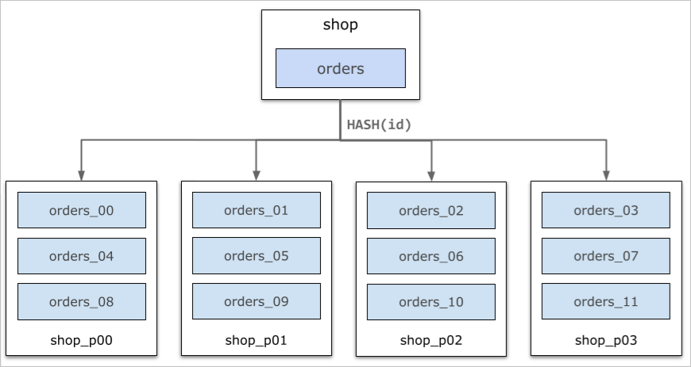

如何分析数据分布不均衡 
================================

本文将介绍如何分析和处理数据倾斜的问题。

概述 
-----------------------

PolarDB-X 在物理资源上是由多个节点所组成的分布式集群。通过数据分区的方式，可以将数据分布到集群中的多个存储节点，发挥多个节点的存储和计算能力。

当存储节点的数据分布不均匀，大部分数据集中在一两个节点时，将导致节点负载过高、查询缓慢，甚至造成节点故障，这种现象称之为数据倾斜。这类问题无法通过扩容来解决，本文将介绍如何分析和处理数据倾斜的问题。



问题分析 
-------------------------

数据倾斜问题可以按照分库级、分表级、分区级的思路由浅入深进行分析排查。

**分库级数据倾斜**

执行`show db status `语句，能够显示当前数据库中的所有物理库的数据大小，部分参数说明如下：

* PHYSICAL_DB：物理库名

* SIZE_IN_MB ：数据大小

* RATIO ：数据比例


示例：

```sql
MySQL polardbx_root@127.1:test_polarx> show db status;
+----+---------------------------+--------------------+---------------------------+------------+--------+----------------+
| ID | NAME                      | CONNECTION_STRING  | PHYSICAL_DB               | SIZE_IN_MB | RATIO  | THREAD_RUNNING |
+----+---------------------------+--------------------+---------------------------+------------+--------+----------------+
| 1  | hehe@polardbx-polardbx    | 100.82.20.151:3306 | TOTAL                     |  0.875     | 100%   | 1              |
| 2  | hehe@polardbx-polardbx    | 100.82.20.151:3306 | hehe_000000               |  0.203125  | 23.21% |                |
| 3  | hehe@polardbx-polardbx    | 100.82.20.151:3306 | hehe_000001               |  0.203125  | 23.21% |                |
| 4  | hehe@polardbx-polardbx    | 100.82.20.151:3306 | hehe_000002               |  0.203125  | 23.21% |                |
| 5  | hehe@polardbx-polardbx    | 100.82.20.151:3306 | hehe_000003               |  0.203125  | 23.21% |                |
| 6  | hehe@polardbx-polardbx    | 100.82.20.151:3306 | hehe_single               |  0.0625    | 7.14%  |                |
+----+---------------------------+--------------------+---------------------------+------------+--------+----------------+
6 rows in set
```


在数据倾斜的情况下，多个物理库的"SIZE_IN_MB"和"RATIO"会相差较大。对于其中数据量较多的分库，可以通过分表级的信息进一步分析。

**分表级数据倾斜**

执行`show table status`语句，查看当前库的所有数据表大小。部分参数说明如下：

* ROWS : 近似的数据行数

* DATA_LENGTH: 近似的数据量


```sql
MySQL polardbx@127.1:test_polarx> show table status;
+----------+--------+---------+------------+------+----------------+-------------+-----------------+--------------+-----------+----------------+---------------------+-------------+------------+--------------------+----------+----------------+---------+
| NAME     | ENGINE | VERSION | ROW_FORMAT | ROWS | AVG_ROW_LENGTH | DATA_LENGTH | MAX_DATA_LENGTH | INDEX_LENGTH | DATA_FREE | AUTO_INCREMENT | CREATE_TIME         | UPDATE_TIME | CHECK_TIME | COLLATION          | CHECKSUM | CREATE_OPTIONS | COMMENT |
+----------+--------+---------+------------+------+----------------+-------------+-----------------+--------------+-----------+----------------+---------------------+-------------+------------+--------------------+----------+----------------+---------+
| test_tb  | InnoDB | 10      | Dynamic    | 0    | 0              | 131072      | 0               | 131072       | 0         | 100000         | 2021-08-19 07:40:07 | <null>      | <null>     | utf8mb4_general_ci | <null>   |                |         |
| test_tb1 | InnoDB | 10      | Dynamic    | 0    | 0              | 65536       | 0               | 65536        | 0         | 100000         | 2021-08-19 07:52:24 | <null>      | <null>     | utf8mb4_general_ci | <null>   |                |         |
+----------+--------+---------+------------+------+----------------+-------------+-----------------+--------------+-----------+----------------+---------------------+-------------+------------+--------------------+----------+----------------+---------+
2 rows in set
```


执行`show table info from $TABLE`语句，查看分表级的数据大小，示例如下：

```sql
MySQL polardbx@127.1:test_polarx> show create table test_tb\G
***************************[ 1. row ]***************************
Table        | test_tb
Create Table | CREATE TABLE `test_tb` (
        `id` int(11) DEFAULT NULL,
        `c1` bigint(20) DEFAULT NULL,
        `c2` varchar(100) DEFAULT NULL,
        KEY `auto_shard_key_id` USING BTREE (`id`)
) ENGINE = InnoDB DEFAULT CHARSET = utf8mb4  dbpartition by hash(`id`) tbpartition by hash(`id`) tbpartitions 2
MySQL polardbx@127.1:test_polarx> show table info from test_tb;
+----+--------------------+----------------+------------+
| ID | GROUP_NAME         | TABLE_NAME     | SIZE_IN_MB |
+----+--------------------+----------------+------------+
| 0  | test_polarx_000000 | test_tb_hg6z_0 | 0.03125    |
| 1  | test_polarx_000000 | test_tb_hg6z_1 | 0.03125    |
| 2  | test_polarx_000001 | test_tb_hg6z_2 | 0.03125    |
| 3  | test_polarx_000001 | test_tb_hg6z_3 | 0.03125    |
| 4  | test_polarx_000002 | test_tb_hg6z_4 | 0.03125    |
| 5  | test_polarx_000002 | test_tb_hg6z_5 | 0.03125    |
| 6  | test_polarx_000003 | test_tb_hg6z_6 | 0.03125    |
| 7  | test_polarx_000003 | test_tb_hg6z_7 | 0.03125    |
+----+--------------------+----------------+------------+
8 rows in set
```


test_tb表的拆分是`dbpartition by hash(id)`和`tbpartition by hash(id) tbpartitions 2`，因此有4个分库，8个分表。以上的`show table info from test_tb`命令中， SIZE_IN_MB即每个分表的数据大小。

如果分表之间的数据容量相差较多，那么即发生了分表的数据倾斜，可能是由于tbpartition by的拆分不当导致的。

**分区级数据倾斜**

对于PolarDB-X 2.0的分区表来说，支持更灵活的数据拆分方式，即LIST/HASH/RANGE分区，以及灵活的分区分裂、合并、迁移。

对于分区表来说，同样支持通过`show table info from $TABLE`命令查询每个分表的物理大小。

除此之外，分区表还支持通过`select * from information_schema.table_detail where logical_table='test_tb' `查询分区级的详细信息，部分参数说明如下：

* PARTITION_NAME ：分区名

* TABLE_ROWS : 分区的数据行数

* DATA_LENGTH ：分区的数据大小

* PERCENT ：分区的数据比例


```sql
+-------------+------------------+---------------+----------------+---------------+----------------+------------+-------------+--------------+----------------------------------------------+------------------------------------+
| SCHEMA_NAME | TABLE_GROUP_NAME | LOGICAL_TABLE | PHYSICAL_TABLE | PARTITION_SEQ | PARTITION_NAME | TABLE_ROWS | DATA_LENGTH | INDEX_LENGTH | BOUND_VALUE                                  | PERCENT                            |
+-------------+------------------+---------------+----------------+---------------+----------------+------------+-------------+--------------+----------------------------------------------+------------------------------------+
| partdb_test | tg73             | test_tb       | test_tb_00000  | 0             | p1             | 0          | 16384       | 16384        | [MINVALUE, -6917529027641081843)             | 0.00%├-------------------------┤   |
| partdb_test | tg73             | test_tb       | test_tb_00001  | 1             | p2             | 1          | 16384       | 16384        | [-6917529027641081843, -4611686018427387893) | 9.09%├███-----------------------┤  |
| partdb_test | tg73             | test_tb       | test_tb_00002  | 2             | p3             | 1          | 16384       | 16384        | [-4611686018427387893, -2305843009213693943) | 9.09%├███-----------------------┤  |
| partdb_test | tg73             | test_tb       | test_tb_00003  | 3             | p4             | 0          | 16384       | 16384        | [-2305843009213693943, 7)                    | 0.00%├-------------------------┤   |
| partdb_test | tg73             | test_tb       | test_tb_00004  | 4             | p5             | 6          | 16384       | 16384        | [7, 2305843009213693957)                     | 54.55%├██████████████------------┤ |
| partdb_test | tg73             | test_tb       | test_tb_00005  | 5             | p6             | 2          | 16384       | 16384        | [2305843009213693957, 4611686018427387907)   | 18.18%├█████---------------------┤ |
| partdb_test | tg73             | test_tb       | test_tb_00006  | 6             | p7             | 1          | 16384       | 16384        | [4611686018427387907, 6917529027641081857)   | 9.09%├███-----------------------┤  |
| partdb_test | tg73             | test_tb       | test_tb_00007  | 7             | p8             | 0          | 16384       | 16384        | [6917529027641081857, 9223372036854775807)   | 0.00%├-------------------------┤   |
+-------------+------------------+---------------+----------------+---------------+----------------+------------+-------------+--------------+----------------------------------------------+------------------------------------|
8 rows in set
```


在以上示例中，分区p5的数据量明显多于其他分区，存在数据倾斜。

解决方案 
-------------------------

数据倾斜通常是由于数据拆分的方式不当造成的，常见原因如下：

* 使用了不恰当的拆分函数，例如UNI_HASH ，但拆分键不具备均匀分布的特征；

* 拆分键的区分度过低，例如HASH分区，按照省份拆分，但省份实际较少，容易造成数据不均；

* 某些拆分键存在较多的数据，例如订单表按照卖家id进行拆分，部分的大卖家可能存在较多的数据。


**拆分方式调整**

对于拆分方式选择不当导致的数据倾斜问题，通常需要调整拆分方式，包括以下两方面：

* 调整拆分函数：分库分表可以选择HASH/UNI_HASH/STR_HASH等拆分函数；分区表可采用HASH/KEYS/RANGE/RANGE COLUMN等拆分方式；

* 调整拆分键：
  * 选择较为均匀，不存在热点的拆分键；
  
  * 选择区分度较高的拆分键，避免HASH结果不均匀；
  
  * 大部分查询都通过拆分键做等值查询，尽量避免查询多个分片。
  

  


在选择好数据拆分方式之后，可以通过如下方法对数据表进行调整：

* 重建表：重建另一个新的表，将旧表的数据导入。
  
  **说明** 此方法需要先停止业务写入。
  

* 在线调整分区：通过变更表类型及拆分规则在线修改分区方式；无需停止业务写入，但此过程仍然需要重写全表数据，开销较大，需要在业务低峰期执行。


示例：用户发现test_tb表存在数据倾斜，原因在于数据拆分键使用不当，因此可以通过以下语句将拆分键调整成hash(order_id)：

```sql
ALTER TABLE test_tb dbpartition BY hash(`order_id`);
```


**分区调整**

在PolarDB-X 2.0中，实现了灵活的基于分区表的数据分布，因此可以实现分区级的分裂及迁移，解决数据倾斜问题。分区调整能够解决的场景主要是分区过大导致的数据倾斜，不适用于拆分函数选择不当等问题。

以Range分区举例：

1. 建表时指定两个分区，p0和p1，其范围分别是 \[-inf, 1000), \[1000, 2000)；

2. 发现分区p0数据过多，存在数据倾斜，因此将分区p0进行分裂，使其分布到多个节点；

3. 默认新建的分区会创建到数据量最少的节点上，如果不满足需求，可另外进行分区迁移。


```sql
CREATE TABLE `table_range` (
        `id` int(11) DEFAULT NULL
) PARTITION BY RANGE(`id`)
(PARTITION p0 VALUES LESS THAN (1000),
 PARTITION p1 VALUES LESS THAN (2000)
) /* tablegroup = `tg110` */ ;
ALTER TABLEGROUP tg110 SPLIT PARTITION p0 INTO 
(partition p0_1 values less than (500), 
 partition p0_2 values less than (1000) );
```


**注意** SPLIT PARTITION操作的对象是TABLEGROUP而非单个表，通过`SHOW FULL CREATE TABLE`命令可以查看一个表所属的tablegroup。
