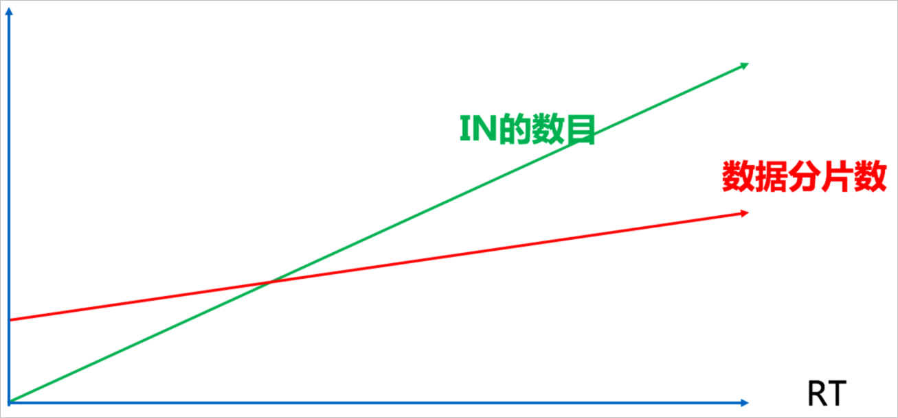
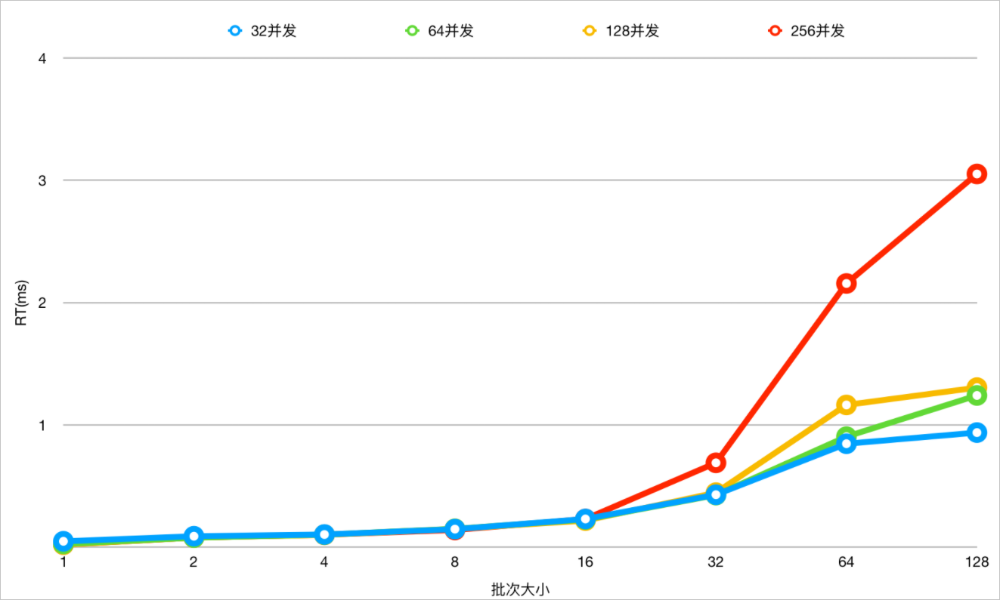
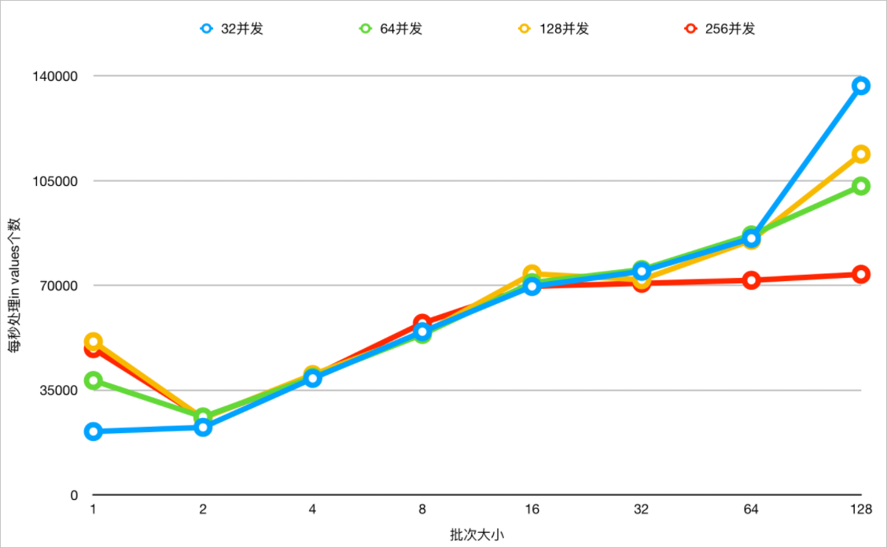

如何高效使用IN查询 
===============================

本文将介绍如何在PolarDB-X中做IN查询时，选择最佳的Values个数。

功能介绍 
-------------------------

实际场景中经常需要根据一些常量指标做IN查询，其中IN的字段是分区键。例如在电商场景中，所有订单都会记录到订单表Order，此表按照订单ID进行拆分，一个买家经常会根据已购买的订单列表，查询这些订单的具体信息。假设用户已购买的订单数是2，那么会产生2个值的IN条件查询，理论上查询会路由到两个2分片。查询SQL示例：

```sql
SELECT * FROM ORDER WHERE ORDER_ID IN (id1,id2)
```


随着用户购买的订单数增加，查询订单信息的IN值数量也会增加，这样一次查询很可能会路由到所有的分片，导致RT变高。下图展示了IN值数量、扫描分片数和RT之间的关系。



为了尽可能避免随着IN值数量增加，导致物理SQL膨胀和扫描压力，PolarDB-X在内核版本5.4.8-16069335（包含）之后引入了基于IN值做动态分区裁剪的能力。

继续以上述场景为例假设Order表分片数量是128，IN查询的数量128个，那么一次查询的SQL为：

```sql
SELECT * FROM ORDER WHERE ORDER_ID IN (id1,id2,id3....id128)
```


如果ID足够离散，可能会分散到所有的分片，需要查询最多128个分片，每个分片的物理查询没有做IN值的裁剪，每个物理查询都会携带128个IN值条件下推给MySQL，过多的IN条件也会加大MySQL执行压力。查询示例如下：

```sql
SELECT * FROM ORDER WHERE ORDER_ID_1 IN (id1,id2,id3....id128);
SELECT * FROM ORDER WHERE ORDER_ID_2 IN (id1,id2,id3....id128);
SELECT * FROM ORDER WHERE ORDER_ID_3 IN (id1,id2,id3....id128);
.....
SELECT * FROM ORDER WHERE ORDER_ID_128 IN (id1,id2,id3....id128);
```


在支持IN分区裁剪的版本上，首先计算层会根据条件计算分片，引入IN值的动态分片裁剪，下发给MySQL的物理查询上就会只包含属于该分片的ID条件，裁剪掉了多余的IN值条件，因此IN查询的RT和吞吐都会有一定的提升。查询示例如下：

```sql
SELECT * FROM ORDER WHERE ORDER_ID_1 IN (id1);
SELECT * FROM ORDER WHERE ORDER_ID_2 IN (id2,id12);
SELECT * FROM ORDER WHERE ORDER_ID_3 IN (id3,id4,id5);
.....
SELECT * FROM ORDER WHERE ORDER_ID_32 IN (id100....id128);
```


另外，PolarDB-X内部针对跨分片的查询会有一个Parallel Query执行，例如涉及32个分片，针对每个用户查询，会有节点CPU内核数大小的并发度，例如分布式下单个节点规格为16core时，默认并发数就是16个，即32个分片会分成2批才能执行完成。

结合以往经验，在IN查询的业务中，建议如下：

* IN的值的数目远小于分片数，这样可以避免每次都做全分片查询；

* IN的值的数目不会随着业务的发展而增长，这样可以避免随着业务变化而导致性能下降；

* 兼顾RT和吞吐的话，建议IN的值的数量在8\~32之间。


满足上述最佳经验后，涉及到IN查询的业务可以做到面向并发场景下的线性扩展，而RT也不会有明显抖动。线性扩展举例：例如分布式16core能跑1万个IN并发，扩展到32core之后就能跑2万个并发。


比对测试 
-------------------------

在兼顾RT和吞吐的场景下，确定合理的IN查询的值的数量。在规格2×16C64G的节点，针对一张分表数量为64，分表记录数为百万级别的表在不同值数量、不同并发下做测试。在内核版本5.4.8-16069335（包含）之后针对IN查询进一步完善了动态裁剪分表的能力，下发的物理SQL也会裁剪掉多余的Values，下面是比对测试的结果。

1. 在不同并发下，不同Values值数量下测试，开启IN查询动态裁剪能力下，查看RT变化。



3. 在不同并发下，不同Values值数量下测试，开启IN查询动态裁剪能力下，查看吞吐变化。



5. 在不同并发下，不同Values值数量下测试，关闭IN查询动态裁剪能力下，查看RT变化。


7. 在不同并发下，不同Values值数量下测试，关闭IN查询动态裁剪能力下，查看吞吐变化。


通过测试对比，可以得到以下结论：

* 兼顾RT和吞吐时，建议IN的值的数量在8\~32之间，基本对齐分布式Parallel Query的默认并发度（单节点的CPU内核数）。

* 在内核版本5.4.8-16069335（包含）之后，在开启IN查询的动态裁剪能力下，吞吐和RT都有明显的优势，推荐您将内核版本升级至5.4.8及以上版本。


