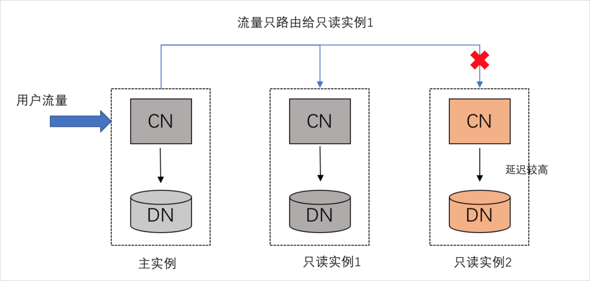

混合负载HTAP的实践和优化 
===================================

背景信息 
-------------------------

本文主要提供数据库 OLTP + OLAP 一体化架构的最佳实践，即 HTAP。主要面对的业务应用范围：

1. 混合型HTAP数据库需求：如ORACLE数据库改造迁移，新数据库方案选型；

2. OLTP系统查询慢，存在分析型场景和瓶颈的客户；

3. 读写分离需求。


PolarDB-X HTAP架构更多信息，请参见[HTAP](../../features/topics/HTAP.md)。

路由 
-----------------------

**智能路由**

PolarDB-X优化器会基于代价分析出查询物理扫描行数、CPU、内存、IO、网络等核心资源消耗量，将请求区分为TP与AP负载。当您在集群地址上开启了智能路由，会主动识别SQL的工作负载类型来做路由，比如将识别为AP负载的流量路由给只读实例。您可以通过explain cost指令查看SQL工作负载类型的识别情况。例如以下查询，该查询涉及到物理扫描行数rowcount很小，计算资源（CPU\&Memory）也消耗比较少，所以这个查询被识别为TP负载。

```sql
mysql> explain cost  select a.k, count(*) cnt from sbtest1 a, sbtest1 b where a.id = b.k and a.id > 1000 group by k having cnt > 1300 order by cnt limit 5, 10;                                                                                                                                                                                                                                                           |
+-----------------------------------------------------------------------------------------------------------------------------------------------------------------------------------------------------------------------------------------------------------------------------------+
| TopN(sort="cnt ASC", offset=?2, fetch=?3): rowcount = 1.0, cumulative cost = value = 2.8765038E7, cpu = 37.0, memory = 64.0, io = 3.0, net = 5.75, id = 163602178                                                                                                                 |
|   Filter(condition="cnt > ?1"): rowcount = 1.0, cumulative cost = value = 2.8765026E7, cpu = 26.0, memory = 47.0, io = 3.0, net = 5.75, id = 163602177                                                                                                                            |
|     HashAgg(group="k", cnt="COUNT()"): rowcount = 1.0, cumulative cost = value = 2.8765025E7, cpu = 25.0, memory = 47.0, io = 3.0, net = 5.75, id = 163602171                                                                                                                     |
|       BKAJoin(condition="k = id", type="inner"): rowcount = 1.0, cumulative cost = value = 2.8765012E7, cpu = 12.0, memory = 18.0, io = 3.0, net = 5.75, id = 163602169                                                                                                           |
|         Gather(concurrent=true): rowcount = 1.0, cumulative cost = value = 2.3755003E7, cpu = 3.0, memory = 0.0, io = 1.0, net = 4.75, id = 163602164                                                                                                                             |
|           LogicalView(tables="[000000-000003].sbtest1_[00-15]", shardCount=16, sql="SELECT `id`, `k` FROM `sbtest1` AS `sbtest1` WHERE (`id` > ?)"): rowcount = 1.0, cumulative cost = value = 2.3755002E7, cpu = 2.0, memory = 0.0, io = 1.0, net = 4.75, id = 163601451         |
|         Gather(concurrent=true): rowcount = 1.0, cumulative cost = value = 5003.0, cpu = 3.0, memory = 0.0, io = 1.0, net = 0.0, id = 163602167                                                                                                                                   |
|           LogicalView(tables="[000000-000003].sbtest1_[00-15]", shardCount=16, sql="SELECT `k` FROM `sbtest1` AS `sbtest1` WHERE ((`k` > ?) AND (`k` IN (...)))"): rowcount = 1.0, cumulative cost = value = 5002.0, cpu = 2.0, memory = 0.0, io = 1.0, net = 0.0, id = 163601377 |                                                                                                                                                                                                                                                                    |
| WorkloadType: TP                                                                                                                                                                                                                                                                  |                                                                                                                                                                                                                                                            |
+-----------------------------------------------------------------------------------------------------------------------------------------------------------------------------------------------------------------------------------------------------------------------------------+
```


工作负载的识别，对于HTAP路由至关重要。这里也允许您通过HINT WORKLOAD_TYPE指定工作负载。同样以上述查询为例，可以将查询负载强制指定为AP。

```sql
mysql> explain cost /*+TDDL:WORKLOAD_TYPE=AP*/ select a.k, count(*) cnt from sbtest1 a, sbtest1 b where a.id = b.k and a.id > 1000 group by k having cnt > 1300 order by cnt limit 5, 10;                                                                                                                                                                                                                                                           |
+-----------------------------------------------------------------------------------------------------------------------------------------------------------------------------------------------------------------------------------------------------------------------------------+
| TopN(sort="cnt ASC", offset=?2, fetch=?3): rowcount = 1.0, cumulative cost = value = 2.8765038E7, cpu = 37.0, memory = 64.0, io = 3.0, net = 5.75, id = 163602178                                                                                                                 |
|   Filter(condition="cnt > ?1"): rowcount = 1.0, cumulative cost = value = 2.8765026E7, cpu = 26.0, memory = 47.0, io = 3.0, net = 5.75, id = 163602177                                                                                                                            |
|     HashAgg(group="k", cnt="COUNT()"): rowcount = 1.0, cumulative cost = value = 2.8765025E7, cpu = 25.0, memory = 47.0, io = 3.0, net = 5.75, id = 163602171                                                                                                                     |
|       BKAJoin(condition="k = id", type="inner"): rowcount = 1.0, cumulative cost = value = 2.8765012E7, cpu = 12.0, memory = 18.0, io = 3.0, net = 5.75, id = 163602169                                                                                                           |
|         Gather(concurrent=true): rowcount = 1.0, cumulative cost = value = 2.3755003E7, cpu = 3.0, memory = 0.0, io = 1.0, net = 4.75, id = 163602164                                                                                                                             |
|           LogicalView(tables="[000000-000003].sbtest1_[00-15]", shardCount=16, sql="SELECT `id`, `k` FROM `sbtest1` AS `sbtest1` WHERE (`id` > ?)"): rowcount = 1.0, cumulative cost = value = 2.3755002E7, cpu = 2.0, memory = 0.0, io = 1.0, net = 4.75, id = 163601451         |
|         Gather(concurrent=true): rowcount = 1.0, cumulative cost = value = 5003.0, cpu = 3.0, memory = 0.0, io = 1.0, net = 0.0, id = 163602167                                                                                                                                   |
|           LogicalView(tables="[000000-000003].sbtest1_[00-15]", shardCount=16, sql="SELECT `k` FROM `sbtest1` AS `sbtest1` WHERE ((`k` > ?) AND (`k` IN (...)))"): rowcount = 1.0, cumulative cost = value = 5002.0, cpu = 2.0, memory = 0.0, io = 1.0, net = 0.0, id = 163601377 |                                                                                                                                                                                                                                                                    |
| WorkloadType: AP                                                                                                                                                                                                                                                                  |                                                                                                                                                                                                                                                            |
+-----------------------------------------------------------------------------------------------------------------------------------------------------------------------------------------------------------------------------------------------------------------------------------+
```

 **规则路由（WIP）**

除了基于代价的智能路由以外，PolarDB-X 也支持基于读写规则的路由。可通过设置读写分离权重参数 MASTER_READ_WEIGHT 实现。MASTER_READ_WEIGHT 默认值为100，可配置值区间\[0, 100\]。如果配置为Weight=60，意味着占60%的流量会继续在主实例执行，40%的剩余流量会路由到只读实例执行，如果只读实例有多个会进行自动分配。

智能路由和规则路由这两者关系是解耦的，具体关系请查看下表格。


| 智能路由规则 |   规则路由 (MASTER_READ_WEIGHT)   |                                                                                                          路由结果                                                                                                           |
|--------|-------------------------------|-------------------------------------------------------------------------------------------------------------------------------------------------------------------------------------------------------------------------|
| 开启     | 以代价的读写分离为主规则路由建议保持默认值为100     | * 事务和写操作流量，全部路由给主实例；  * 识别为AP的查询流量，全部路由给只读实例；  * 识别为TP的查询流量，按照（100-MASTER_READ_WEIGHT）路由给只读实例。   |
| 关闭     | 以规则的读写分离为主规则路由的可选范围：\[0-100\] | * 事务和写操作流量，全部路由给主实例；  * 识别为TP/AP的查询流量，一律按照（100-MASTER_READ_WEIGHT）路由给只读实例。                                                         |


执行模式 
-------------------------

目前PolarDB-X支持了三种执行模式： 

* 单机单线程（TP_LOCAL）：查询过程中，是单线程计算，TP负载的查询涉及到的扫描行数比较少，往往会采样这种执行模式，比如基于主键的点查。

* 单机并行（AP_LOCAL）：查询过程中，会利用节点的多核资源做并行计算，您在没有购买只读实例的前提下，针对AP负载的查询，往往会采样这种执行模式，一般也称之为Parallel Query模式。

* 多机并行（MPP）（WIP）：针对AP负载的查询，可以协调只读实例上多个节点的多核做分布式多机并行加速。


为了让您可以准确知道执行模式，我们在原有[EXPLAIN](../../dev-guide/topics/explain.md)指令上，扩展出了EXPLAIN PHYSICAL。例如以下查询，通过指令可以查看到当前查询采样的是MPP模式，此外还可以获取到每个执行片段的并发数。

```sql
mysql> explain physical select a.k, count(*) cnt from sbtest1 a, sbtest1 b where a.id = b.k and a.id > 1000 group by k having cnt > 1300 or
der by cnt limit 5, 10;
+-------------------------------------------------------------------------------------------------------------------------------------------------------------------+
| PLAN                                                                                                                                                              |
+-------------------------------------------------------------------------------------------------------------------------------------------------------------------+
| ExecutorType: MPP                                                                                                                                                 |
| The Query's MaxConcurrentParallelism: 2                                                                                                                           |
| Fragment 1                                                                                                                                                        |
|     Shuffle Output layout: [BIGINT, BIGINT] Output layout: [BIGINT, BIGINT]                                                                                       |
|     Output partitioning: SINGLE [] Parallelism: 1                                                                                                                 |
|     TopN(sort="cnt ASC", offset=?2, fetch=?3)                                                                                                                     |
|   Filter(condition="cnt > ?1")                                                                                                                                    |
|     HashAgg(group="k", cnt="COUNT()")                                                                                                                             |
|       BKAJoin(condition="k = id", type="inner")                                                                                                                   |
|         RemoteSource(sourceFragmentIds=[0], type=RecordType(INTEGER_UNSIGNED id, INTEGER_UNSIGNED k))                                                             |
|         Gather(concurrent=true)                                                                                                                                   |
|           LogicalView(tables="[000000-000003].sbtest1_[00-15]", shardCount=16, sql="SELECT `k` FROM `sbtest1` AS `sbtest1` WHERE ((`k` > ?) AND (`k` IN (...)))") |
| Fragment 0                                                                                                                                                        |
|     Shuffle Output layout: [BIGINT, BIGINT] Output layout: [BIGINT, BIGINT]                                                                                       |
|     Output partitioning: SINGLE [] Parallelism: 1 Splits: 16                                                                                                      |
|     LogicalView(tables="[000000-000003].sbtest1_[00-15]", shardCount=16, sql="SELECT `id`, `k` FROM `sbtest1` AS `sbtest1` WHERE (`id` > ?)")                     |
+-------------------------------------------------------------------------------------------------------------------------------------------------------------------+
```


工作负载和执行模式有一定的耦合关系，AP工作负载会采用多机并行计算。同样的也允许您通过HINT EXECUTOR_MODE指定执行模式。假如主实例空闲资源很多，可以考虑强制设置为单机或者多机并行模式来加速。

```sql
mysql> explain physical /*+TDDL:EXECUTOR_MODE=AP_LOCAL*/select a.k, count(*) cnt from sbtest1 a, sbtest1 b where a.id = b.k and a.id > 1000 group by k having cnt > 1300 order by cnt limit 5, 10;                                                                                                                                                     |
+-------------------------------------------------------------------------------------------------------------------------------------------------------------+
| ExecutorMode: AP_LOCAL                                                                                                                                      |
| Fragment 0 dependency: [] parallelism: 4                                                                                                                    |
| BKAJoin(condition="k = id", type="inner")                                                                                                                   |
|   Gather(concurrent=true)                                                                                                                                   |
|     LogicalView(tables="[000000-000003].sbtest1_[00-15]", shardCount=16, sql="SELECT `id`, `k` FROM `sbtest1` AS `sbtest1` WHERE (`id` > ?)")               |
|   Gather(concurrent=true)                                                                                                                                   |
|     LogicalView(tables="[000000-000003].sbtest1_[00-15]", shardCount=16, sql="SELECT `k` FROM `sbtest1` AS `sbtest1` WHERE ((`k` > ?) AND (`k` IN (...)))") |
| Fragment 1 dependency: [] parallelism: 8                                                                                                                    |
| LocalBuffer                                                                                                                                                 |
|   RemoteSource(sourceFragmentIds=[0], type=RecordType(INTEGER_UNSIGNED id, INTEGER_UNSIGNED k, INTEGER_UNSIGNED k0))                                        |
| Fragment 2 dependency: [0, 1] parallelism: 8                                                                                                                |
| Filter(condition="cnt > ?1")                                                                                                                                |
|   HashAgg(group="k", cnt="COUNT()")                                                                                                                         |
|     RemoteSource(sourceFragmentIds=[1], type=RecordType(INTEGER_UNSIGNED id, INTEGER_UNSIGNED k, INTEGER_UNSIGNED k0))                                      |
| Fragment 3 dependency: [0, 1] parallelism: 1                                                                                                                |
| LocalBuffer                                                                                                                                                 |
|   RemoteSource(sourceFragmentIds=[2], type=RecordType(INTEGER_UNSIGNED k, BIGINT cnt))                                                                      |
| Fragment 4 dependency: [2, 3] parallelism: 1                                                                                                                |
| TopN(sort="cnt ASC", offset=?2, fetch=?3)                                                                                                                   |
|   RemoteSource(sourceFragmentIds=[3], type=RecordType(INTEGER_UNSIGNED k, BIGINT cnt))                                                                      |
+-------------------------------------------------------------------------------------------------------------------------------------------------------------+
```


在多机并行MPP执行模式的并发度是根据物理扫描行数、实例规格和计算所涉及到表的分表数来计算出来的，整体的并行度要考虑高并发场景，所以并行度的计算会偏保守，您可以通过上述EXPLAIN PHYSICAL指令查看并行度。当然也同样支持HINT MPP_PARALLELISM强制指定并行度，

```sql
/*+TDDL:EXECUTOR_MODE=MPP MPP_PARALLELISM=8*/select a.k, count(*) cnt from sbtest1 a, sbtest1 b where a.id = b.k and a.id > 1000 group by k having cnt > 1300 order by cnt limit 5, 10;
```


调度策略（WIP）
-------------------------

假设有多个只读实例并加入到集群地址中，您通过集群地址的查询SQL路由到只读实例的流量，会被均匀调度到只读实例多个节点上执行，调度会考虑各个节点的资源负载，确保各个节点的负载压力差不多。比如PolarDB-X会将只读实例延迟作为调度参考指标，避免将流量调度到延迟较大的只读实例上执行。



反馈机制 
-------------------------

基于统计信息智能识别负载存在一定的误差。在负载识别出错的情况下，PolarDB-X能基于查询最终真实扫描的物理行数和执行时间，重新修正工作负载，这个过程我们称之为负载的自适应反馈。根据[执行计划管理](../../sql-tunning/topics/spm.md)一文，PolarDB-X的执行计划会被管理起来，同样其工作负载也会被管理起来，用户可以通过以下语句，查看执行计划管理中各个计划的工作负载。

```sql
baseline [Select Statemtnt]
```


比如当一条TP负载的简单查询，执行时间和真实扫描行数都大于阈值，这个查询就会被修正为AP工作负载，写入到执行计划管理状态中，同理反之。除了上述提到了自适应反馈能力以外，我们也可以通过以下语句，手动修正计划管理中的工作负载。

```sql
baseline fix sql /*+TDDL:WORKLOAD_TYPE=AP*/ [Select Statemtnt]
```


执行计划管理中的计划负载被合理修正后，同类型的查询会从执行计划管理中获取正确的工作负载标记。

一致性读（WIP）
-------------------------


如果业务使用的集群地址，对数据一致性读并没有强烈诉求，例如业务可以忽略当前只读实例复制延迟带来的数据影响，我们也支持在参数管理页面上配置ENABLE_CONSISTENT_REPLICA_READ，或者通过HINT对某个查询关闭一致性读能力。

```sql
/*+TDDL:ENABLE_CONSISTENT_REPLICA_READ=false*/ [Select Statemtnt]
```


