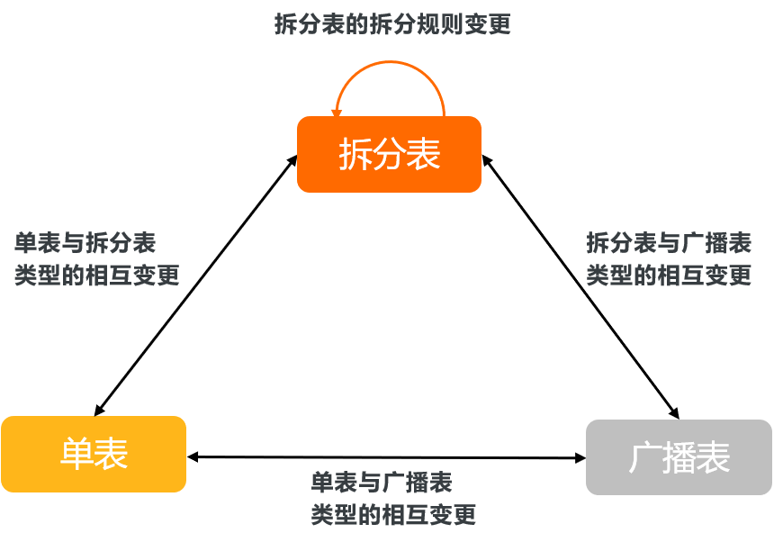

变更表类型及拆分规则 
===============================

PolarDB-X新增支持变更表的类型（即在单表、拆分表和广播表三者间进行相互转换），和变更拆分表的拆分规则（包括拆分函数或拆分列）。本文介绍相关语法和示例。

前提条件 
-------------------------

* 仅内核小版本为5.4.8或以上的PolarDB-X实例支持变更拆分表的拆分规则。

* 仅内核小版本为5.4.10或以上的PolarDB-X实例支持变更表的类型（即在单表、拆分表和广播表三者间进行相互转换）。


### 如何查看实例版本
您可以先连接PolarDB-X 2.0数据库，再通过执行如下 `select version()` 命令查看目标实例的当前版本：
```sql
mysql> select version();
+-----------------------------+
| VERSION()                   |
+-----------------------------+
| 5.6.29-TDDL-5.4.8-16079964  |
+-----------------------------+
1 row in set (0.00 sec)         
```


注意事项 
-------------------------

* 仅内核小版本为5.4.13或以上的PolarDB-X实例支持变更带有GSI的拆分表的拆分规则。

* 表属性变更后，主键拆分表将变成普通表（即不再适用原主键拆分表中的自动拆分规则或索引转换规则）。更多详情，请参见[主键拆分](sharding-by-pk.md)。

* 若单表设置了自增列，在变更为广播表或拆分表时，需提前为该表创建Sequence。如何创建Sequence，请参见[显式用法](explict-usage.md)。

* 本文中关于变更拆分表、广播表和单表的表类型示例，均在单表`t_order`的基础上进行变更，`t_order`表的创建语句如下：

  ```sql
  CREATE TABLE t_order (
    `id` bigint(11) NOT NULL AUTO_INCREMENT BY GROUP,
    `order_id` varchar(20) DEFAULT NULL,
    `buyer_id` varchar(20) DEFAULT NULL,
    `seller_id` varchar(20) DEFAULT NULL,
    `order_snapshot` longtext DEFAULT NULL,
    `order_detail` longtext DEFAULT NULL,
    PRIMARY KEY (`id`),
    KEY `l_i_order` (`order_id`)
  ) ENGINE=InnoDB DEFAULT CHARSET=utf8;
  ```

  


表类型 
------------------------

PolarDB-X实例支持3种类型的表：拆分表、广播表和单表。您可以通过ALTER TABLE语句在拆分表、广播表和单表间进行转换，同时还能对拆分表的拆分规则进行变更。



* **拆分表**

  使用`drds_partition_options`子句进行拆分的表。

  `drds_partition_options`可以是如下分库或分表子句：

  ```sql
  drds_partition_options:
  DBPARTITION BY db_partition_algorithm
  [TBPARTITION BY table_partition_algorithm [TBPARTITIONS number]]
  ```

  

  其中：
  * `db_partition_algorithm`支持如下函数：

    ```sql
    db_partition_algorithm:
        HASH([col_name])
      | {YYYYMM|YYYYWEEK|YYYYDD|YYYYMM_OPT|YYYYWEEK_OPT|YYYYDD_OPT}(col_name)
      | UNI_HASH(col_name)
      | RIGHT_SHIFT(col_name, n)
      | RANGE_HASH(col_name, col_name, n)
    ```

    

  * `table_partition_algorithm`支持如下函数：

    ```sql
    table_partition_algorithm:
        HASH(col_name)
      | {MM|DD|WEEK|MMDD|YYYYMM|YYYYWEEK|YYYYDD|YYYYMM_OPT|YYYYWEEK_OPT|YYYYDD_OPT}(col_name)
      | UNI_HASH(col_name)
      | RIGHT_SHIFT(col_name, n)
      | RANGE_HASH(col_name, col_name, n)
    ```

    

  **说明** 更多关于拆分函数的信息，请参见 [拆分函数概述](sharding-functions.md) 。

  

  

  

* **广播表**

  通过`BROADCAST`子句创建的表，系统会将该表复制到每个分库上，并通过分布式事务实现数据一致性。更多详情，请参见[广播表](create-table.md)。
  
* **单表**

  未进行任何拆分或未指定`BROADCAST`子句的表。更多详情，请参见[单库单表](create-table.md)。
  


单表或广播表变为拆分表 
--------------------------------

* **语法**

  ```sql
  ALTER TABLE table_name drds_partition_options;
  ```

  
  **说明**
  * 更多关于`drds_partition_options`的信息，请参见本小节中的表类型。
  
  * 若单表设置了自增列，在变更为拆分表时，需提前为该表创建Sequence。如何创建Sequence，请参见[显式用法](explict-usage.md)。
  

  
  

* **示例**

  因业务扩展，单表`t_order`无法承载日益增长的数据。此时，您可以使用如下语句将该单表变更为拆分表（以`order_id`为拆分键）：

  ```sql
  ALTER TABLE t_order dbpartition BY hash(`order_id`);
  ```

  


单表或拆分表变为广播表 
--------------------------------

* **语法**

  ```sql
  ALTER TABLE table_name BROADCAST;
  ```

  **说明** 若单表设置了自增列，在变更为广播表时，需提前为该表创建Sequence。如何创建Sequence，请参见[显式用法](explict-usage.md)。
  
* **示例**

  您可以使用如下语句将单表或拆分表`t_order`变更为广播表：

  ```sql
  ALTER TABLE t_order BROADCAST;
  ```

  

  


广播表或拆分表变为单表 
--------------------------------

* **语法**

  ```sql
  ALTER TABLE table_name SINGLE;
  ```

  

* **示例**

  您可以使用如下语句将广播表或拆分表`t_order`变更为单表：

  ```sql
  ALTER TABLE t_order SINGLE;
  ```

  

  


变更拆分表的拆分规则 
-------------------------------

* **语法**

  ```sql
  ALTER TABLE tbl_name drds_partition_options;
  ```

  

* **示例**

  假设已使用如下语句在PolarDB-X数据库中创建了一张拆分表`t_order`（根据`order_id`列进行库级拆分）：

  ```sql
  CREATE TABLE t_order (
    `id` bigint(11) NOT NULL AUTO_INCREMENT,
    `order_id` varchar(20) DEFAULT NULL,
    `buyer_id` varchar(20) DEFAULT NULL,
    `seller_id` varchar(20) DEFAULT NULL,
    `order_snapshot` longtext DEFAULT NULL,
    `order_detail` longtext DEFAULT NULL,
    PRIMARY KEY (`id`),
    KEY `l_i_order` (`order_id`)
  ) ENGINE=InnoDB DEFAULT CHARSET=utf8 
  dbpartition BY hash(`order_id`);
  ```

  

  现需要对`t_order`表的拆分规则作出如下变更：
  * 根据`order_id`列进行库级拆分。
  
  * `buyer_id`列做表级拆分。
  
  * 每个分库包含3个分表。
  
  
  

  您可以使用如下语句实现上述变更：

  ```sql
  ALTER TABLE t_order dbpartition BY hash(order_id) tbpartition BY hash(buyer_id) tbpartitions 3;
  ```

  


相关文档 
-------------------------

拆分规则变更后，您可以通过如下命令查看表的拆分规则或拓扑结构：

* 查看表拆分规则，请参见[SHOW FULL RULE \[FROM tablename\]](show-topology.md)。

* 查看表拓扑结构，请参见[SHOW TOPOLOGY FROM tablename](show-topology.md)。


常见问题 
-------------------------

Q：为什么有时拆分键变更的DDL任务会执行失败？此时该如何处理？

A：实例崩溃或唯一索引存在冲突等因素会导致拆分规则变更的DDL任务执行失败。但这不会损坏原表任何数据，也不会阻塞正常的DML和查询语句执行。当拆分键变更的DDL任务执行失败时，您可以通过`CANCEL DDL`命令回滚该任务，然后再次尝试变更。关于`CANCEL DDL`命令的详情，请参见[回滚任务](cancel-ddl.md)。
