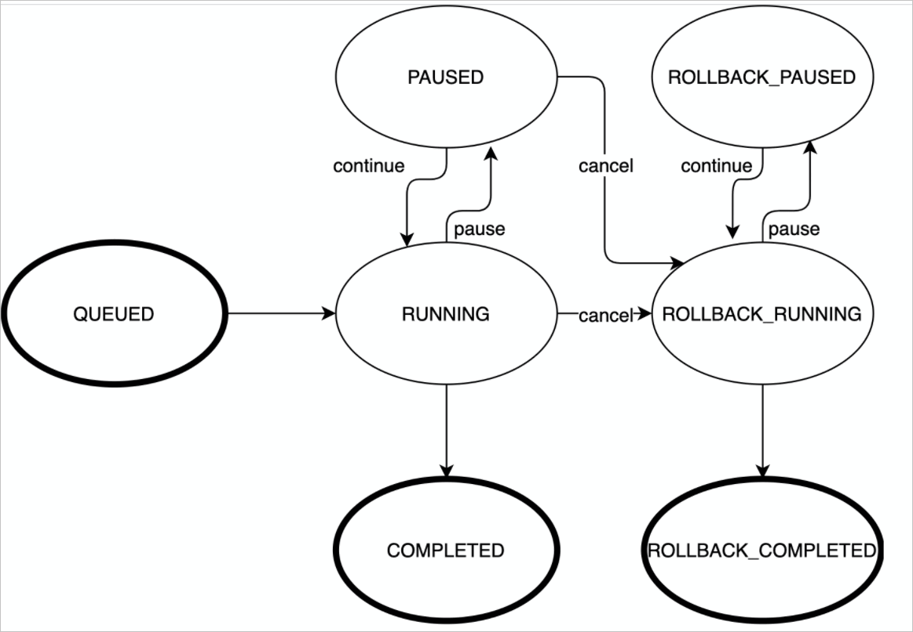

SHOW DDL 
=============================

一条DDL语句会以一个DDL任务方式在PolarDB-X内部执行，使用SHOW DDL命令可以查看当前PolarDB-X实例中的DDL任务。

语法 
-----------------------

```sql
SHOW [FULL] DDL;
```


示例 
-----------------------

```sql
mysql> show ddl\G;
*************************** 1. row ***************************
           JOB_ID: 1359947811109470208
    OBJECT_SCHEMA: d1
      OBJECT_NAME: t2
           ENGINE: DAG
         DDL_TYPE: ALTER_TABLE
            STATE: PAUSED
BACKFILL_PROGRESS: 0%
 PHY_DDL_PROGRESS: 100%
         PROGRESS: 20%
       START_TIME: 2021-08-05 11:01:25.291
         END_TIME: 2021-08-05 11:02:27.020
 ELAPSED_TIME(MS): 61729
      PHY_PROCESS: 
       CANCELABLE: true
1 row in set (0.03 sec)
```


返回参数说明 
---------------------------


| 参数名称          | 说明                                                |
| ----------------- | --------------------------------------------------- |
| JOB_ID            | DDL任务唯一标识，取值需为64位有符号长整型数值。     |
| OBJECT_SCHEMA     | DDL任务对象的Schema名称。                           |
| OBJECT_NAME       | DDL任务对象名称，例如当前执行DDL的表名称。          |
| ENGINE            | DDL任务引擎类型，默认为DAG。                        |
| DDL_TYPE          | DDL任务类型，例如，`CREATE_TABLE`。                 |
| STATE             | DDL任务当前所处的状态，具体请参见下表DDL状态。      |
| BACKFILL_PROGRESS | DDL任务中，数据回填的进度。                         |
| PHY_DDL_PROGRESS  | DDL任务中，当前执行的一批物理DDL的进度。            |
| PROGRESS          | DDL任务的总体进度。                                 |
| START_TIME        | DDL任务开始执行的时间。                             |
| END_TIME          | DDL任务结束执行的时间。                             |
| ELAPSED_TIME(MS)  | DDL任务截止到任务查看时已经消耗的时间，单位：毫秒。 |
| PHY_PROCESS       | 执行中的物理DDL的状态。                             |
| CANCELABLE        | DDL任务是否可通过`CANCEL DDL`命令取消。             |


DDL状态 
--------------------------

SHOW DDL命令返回的STATE字段标示了DDL任务的状态，状态转移图如下所示：



绝大多数情况，DDL任务会按照`QUEUED->RUNNING->COMPLETED`的流程执行成功。

异常情况下，DDL任务可能会自动回滚，此时的流程为`QUEUED->RUNNING->ROLLBACK_RUNNING->ROLLBACK_COMPLETED`。

特殊情况下，DDL任务的状态还可以通过命令干预，上图中箭头上展示的是可用于修改DDL任务状态的命令。
