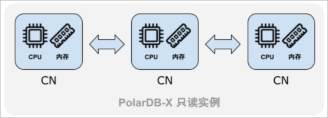
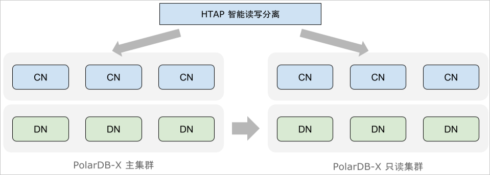

# 混合负载HTAP

PolarDB-X是一款支持HTAP（Hybrid Transaction/Analytical Processing）的数据库，在支持高并发、事务性请求的同时，也对分析型的复杂查询提供了良好的支持。

**说明** 分析型查询指的是涉及数据量较大、计算比较复杂的查询，例如对一定时间区间内的数据进行聚合。相比于业务中常见的简单查询，这类查询往往要执行数秒甚至分钟，需要消耗较多的计算资源。

为了加速复杂分析型查询，PolarDB-X将计算任务切分并调度到多个计算节点上，从而利用多个节点的计算能力，加速查询的执行。这种方式也称为MPP并行计算。

## 查询优化器 

PolarDB-X的优化器面向HTAP负载设计，对复杂查询有着良好的支持。具体来说，TP类查询包含的表数量通常有限（例如3个以内），且Join条件往往被索引覆盖，并且查询涉及的数据量较小。而对于不符合上述特征的复杂查询，则对优化器提出了更高的要求。

PolarDB-X采用了基于代价的优化器技术，能够根据实际数据量、数据分布情况等，搜索到较优的执行计划，例如，对Join顺序进行调整、选择合适的Join或聚合算法，对关联子查询去关联化等。

## HTAP智能路由（WIP）

现阶段，阻碍HTAP数据库实际应用的一大障碍是分析型查询（AP）对在线业务流量（TP）的影响。为了解决这一问题，PolarDB-X支持部署独立的只读集群，只读集群与原集群在硬件资源上完全分离，从而将AP查询对TP流量的影响降到最低。

PolarDB-X优化器会基于代价估计将请求区分为TP与AP负载，其中AP查询会被进一步改写为分布式执行计划，发往只读集群进行计算，避免它对主实例的TP查询造成影响。

## 分布式执行 

分布式执行计划下一步会被切分为多个阶段（Stage），每个阶段又会生成多个并行的分片（Split），这些分片被下发到多个计算节点执行。计算节点之间通过高速网络互联。在计算过程中往往需要对中间结果进行多次交换（Exchange），直到最后一个Stage将结果收集汇总、回复给发起查询的客户端。

## 全局一致性读（WIP）

传统读写分离架构下，数据复制的延迟可能带来的数据写后读（read-after-write）不一致问题。PolarDB-X中，对于路由给只读实例的查询，默认开启全局一致性读能力，确保业务不会读到过期的数据，向主实例写入成功后能在只读库读到写入的数据。
