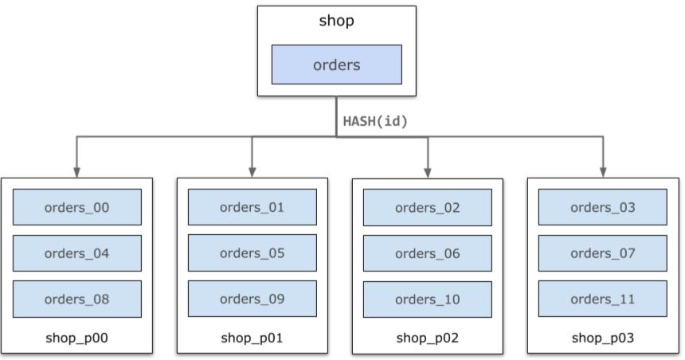
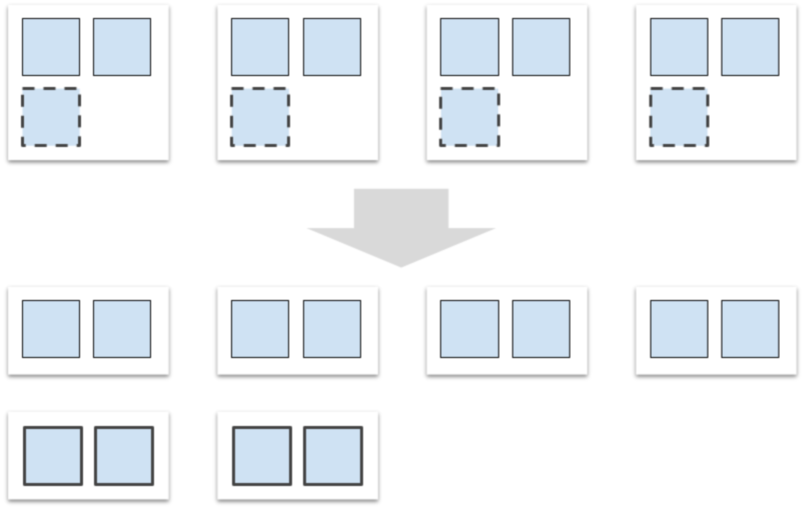

# 水平扩展 

## 数据物理分布 

PolarDB-X将数据表以水平分区的方式，分布在多个DN（Data Node，数据节点）上。数据分区方式由分区函数决定，PolarDB-X支持哈希（Hash）、范围（Range）等常用的分区函数。

以下图为例，shop库中的orders表根据每行数据的id属性的哈希，被水平切分成orders_00～orders_11共计12个分区，均匀分布在4个数据节点上。PolarDB-X的分布式SQL层将会自动完成查询路由、结果合并等。



## 扩容迁移 

随着业务的增长，数据量越来越大，往往需要添加更多的数据节点以承载更多的数据。当新的数据节点加入集群时，PolarDB-X将自动触发扩容任务，将数据进行再平衡（Rebalance）。

以下图为例，orders表原本分布在4个数据节点上。进行扩容后，集群的数据节点数量从4个增加到6个，触发再平衡任务，将部分数据分区从旧节点移动到新节点上。这一过程会在后台利用空闲资源完成，对业务线上流量无影响。



## 表组（WIP）

为了提升Join查询性能，PolarDB-X推荐根据业务场景设计各个表的分区键，使得有关联关系的表具有相同的分区方式。

例如下图中，user、orders、lineitem、delivery这四张表都以HASH(user_id) 作为分区函数，对于下面的查询可以下推到数据节点上执行，性能更好。

```sql
SELECT * FROM user, orders WHERE user.id = orders.user_id WHERE user.id = ...
```

PolarDB-X引入了表组（Table Group）概念来描述分区方式相同的表。通常情况下，分区函数以及列类型相同的表会被隐式地自动归入同一表组中。表组内的分区组（Partition Group）包含了这些表对应的分区。


表组的概念对于分区的迁移、分裂与合并至关重要。在上面的例子中，如果对user表的某个分区进行迁移而不迁移orders表的对应分区，那么上文中的查询将无法下推到数据节点，导致性能大幅下降。但有了表组的概念之后，由于user表和orders表位于同一表组中，它们的分区迁移、分裂与合并都会同步进行，解决了上述的问题。
