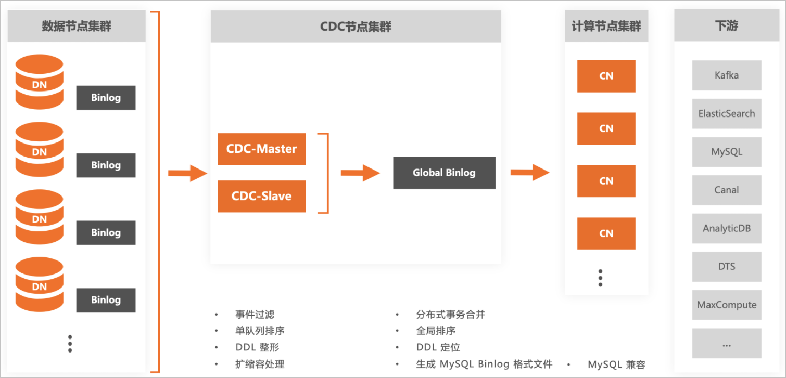

全局日志变更 CDC
==============================

MySQL binlog是MySQL记录变更数据的"二进制日志"，它可以看做是一个消息队列，队列中按顺序保存了MySQL中详细的增量变更信息，通过消费队列中的变更条目，下游系统或工具实现了与MySQL的实时数据同步，这样的机制也称为CDC（Change Data Capture，增量数据捕捉）。

PolarDB-X是兼容MySQL生态的分布式数据库。通过集群内的CDC组件，PolarDB-X 能够提供与MySQL binlog格式兼容的变更日志，并且隐藏掉集群扩缩容、分布式事务、全局索引等分布式特性对外部的影响，以便提供与单机MySQL数据库一致的使用体验。

**异地多活** 

除了通过CDC将数据同步其他外部系统中，PolarDB-X CDC也可以用于实现"异地多活"的业务部署。例如，将用户ID按照所在地区划分到不同机房，用户的写入操作必须在特定机房进行，而读取操作可以读就近的"副本"，这些副本数据就通过CDC从原机房同步得到。
