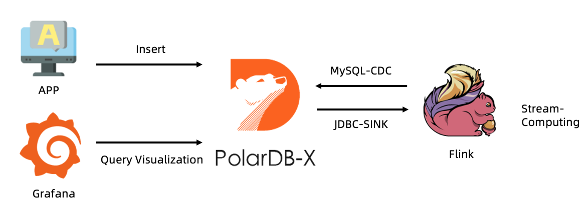
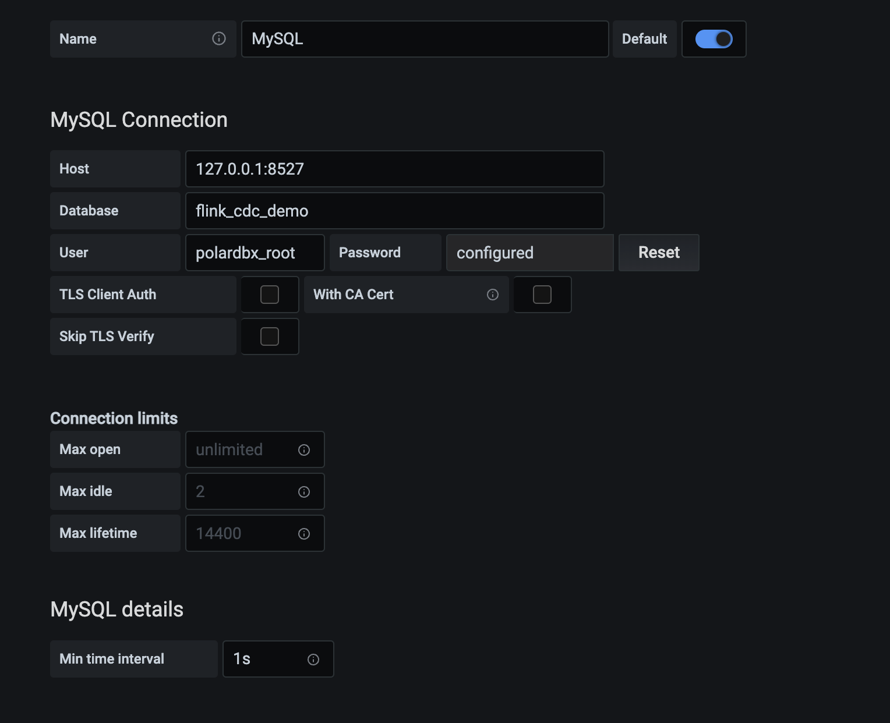
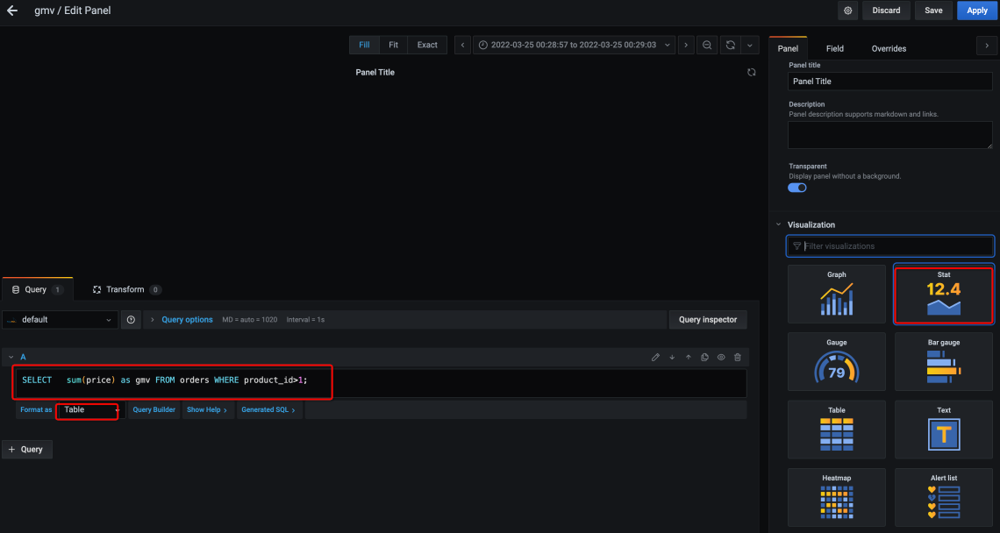

# 使用Flink订阅PolarDB-X CDC

本小节介绍如何通过Flink实时订阅PolarDB-X的增量数据，通过简单配置示例（零代码）搭建实时数据大屏。



## 演示环境说明

建议通过MacOS或者Linux机器来进行操作。

**环境版本说明：**

| 实例      | 版本说明 |
| :-------- | :------- |
| PolarDB-X | >= 2.0.1 |
| Flink     | >=1.13.6 |
| Flink-CDC | >= 2.2   |

## 准备PolarDB-X环境

### 安装PolarDB-X

如果您已经安装了Docker环境，请执行以下脚本完成PolarDB-X的安装，该过程大概需要1-2分钟。

```bash
# 获取PolarDB-X镜像
docker pull polardbx/polardb-x:2.0.1

# 启动PolarDB-X, 并暴露8527端口, 这里可能需要1-2分钟
docker run -d --name polardbx-play -p 8527:8527 polardbx/polardb-x

# 通过MySQL客户端验证启动
mysql -h127.1 -P8527 -upolardbx_root -p"123456"
```

> **注意**：PolarDB-X集群部署方式有PXD、Kubernetes等，详情请参见[快速入门](../../quickstart/topics/Quick-Start.md)。

## 准备Flink环境

- 安装Flink
- 下载Flink Connector（jar包）
  - Connector for MySQL-CDC：订阅PolarDB-X Binlog
  - Connector For Jdbc：用于Jdbc写入
  - Connector For MySQL：用于支持MySQL写入

```bash
# 下载Flink安装包并解压
wget https://dlcdn.apache.org/flink/flink-1.13.6/flink-1.13.6-bin-scala_2.11.tgz
tar -xzvf flink-1.13.6-bin-scala_2.11.tgz

# Flink的插件均以jar包形式存放在${FLINK_HOME}/lib目录下
cd flink-1.13.6/lib

# 下载Flink-CDC插件，用于订阅增量日志
wget https://repo1.maven.org/maven2/com/ververica/flink-sql-connector-mysql-cdc/2.2.0/flink-sql-connector-mysql-cdc-2.2.0.jar

# 下载Flink-JDBC插件Flink-MySQL驱动，用于写入PolarDB-X
wget https://repo.maven.apache.org/maven2/org/apache/flink/flink-connector-jdbc_2.11/1.13.6/flink-connector-jdbc_2.11-1.13.6.jar
wget https://repo.maven.apache.org/maven2/mysql/mysql-connector-java/8.0.28/mysql-connector-java-8.0.28.jar

# 回到${FLINK_HOME}，分别启动Flink服务端
cd ..
./bin/start-cluster.sh
```

> 更多关于Flink的详情，请访问[Flink官网](https://flink.apache.org/)及[Flink-CDC官网](https://ververica.github.io/flink-cdc-connectors)。

## 准备数据

### 准备PolarDB-X数据

- trades表：模拟交易表，用于模拟用户支付行为
- shop_gmv_d表：模拟成交金额实时统计表，用于统计当天成交金额

```sql
# 登录PolarDB-X
mysql -h127.1 -P8527 -upolardbx_root -p"123456"

# 创建数据库
create database flink_cdc_demo;
use flink_cdc_demo;

# 订单表
create table `trades` (
  id integer auto_increment NOT NULL,
  shop_id integer comment '店铺id',
  pay_amount decimal  comment '支付金额', 
  stat_date date comment '统计时间',
  primary key(id)
) comment ='交易表' dbpartition by hash(id);

# 模拟用户支付行为，此处假定每单金额为10
insert trades values(default, 1001, 10, '2022-03-15');
insert trades values(default, 1001, 10, '2022-03-15');
insert trades values(default, 1001, 10, '2022-03-15');
insert trades values(default, 1001, 10, '2022-03-15');
insert trades values(default, 1001, 10, '2022-03-15');

# 接收Flink写入的GMV
create table `shop_gmv_d` (
  stat_date date comment '统计时间',
  shop_id integer comment '店铺id',
  gmv decimal comment '成交总额',
  primary key(stat_date, shop_id)
) comment = '店铺1天实时成交金额';
```

### 准备Flink测试表

```bash
# 登录Flink客户端
./bin/sql-client.sh

# 设置check point间隔为3s
SET 'execution.checkpointing.interval' = '3s';

# 创建Flink source表，用于订阅PolarDB-X增量数据
CREATE TABLE trades (
    id integer,
    shop_id integer,
    pay_amount decimal, 
    stat_date date,
    PRIMARY KEY (id) NOT ENFORCED
  ) WITH (
    'connector' = 'mysql-cdc',
    'hostname' = 'localhost',
    'port' = '8527',
    'username' = 'polardbx_root',
    'password' = '123456',
    'database-name' = 'flink_cdc_demo',
    'table-name' = 'trades'
  );

# 观察PolarDB-X的数据变化
select * from trades; 

# 创建Flink sink表，用于将统计数据写回PolarDB-X

CREATE TABLE shop_gmv_d (
    stat_date date,
    shop_id integer,
    gmv decimal,
    primary key(stat_date, shop_id) NOT ENFORCED
 ) WITH (
   'connector' = 'jdbc',
   'url' = 'jdbc:mysql://localhost:8527/flink_cdc_demo',
   'username' = 'polardbx_root',
   'password' = '123456',
   'table-name' = 'shop_gmv_d'
 );

# 实时计算1天的成交总额，并写回PolarDB-X
insert into shop_gmv_d
select stat_date, shop_id, sum(pay_amount) as gmv
from trades group by stat_date, shop_id;
```

示例截图：


登录PolarDB-X验证Flink写入结果：

```sql
# 登录PolarDB-X
mysql -h127.1 -P8527 -upolardbx_root -p"123456"

# 切换数据库
use flink_cdc_demo;

# 观察成交金额变化
select * from shop_gmv_d;

# 继续模拟用户的下单行为
insert trades values(default, 1001, 10, '2022-03-15');
insert trades values(default, 1001, 10, '2022-03-15');
insert trades values(default, 1001, 10, '2022-03-15');
insert trades values(default, 1001, 10, '2022-03-15');
insert trades values(default, 1001, 10, '2022-03-15');

# 观察成交金额变化
select * from shop_gmv_d;
```

继续模拟trades的支付行为，可以观察到GMV的值在不断增长：


## 配置Grafana

您可以通过使用可视化工具，更直观地观测数据的变化。

### 下载Grafana

```bash
# 下载Grafana
wget https://mirrors.huaweicloud.com/grafana/7.1.5/grafana-7.1.5.darwin-amd64.tar.gz

# 解压
tar -xzvf grafana-7.1.5.darwin-amd64.tar.gz
cd grafana-7.1.5
```

### 修改参数

将默认刷新间隔由5s修改为60ms，使图表可以实时刷新：

```bash
vi conf/defaults.ini
# 修改参数
min_refresh_interval = 60ms

# 启动Grafana
./bin/grafana-server web
```

访问Grafana控制台[http://localhost:3000](http://localhost:3000/)（默认用户名和密码均为admin）。

### 配置Dashboard

单击“Configuration”->“Data Sources”->“Add data source”，新增数据源。




新增Dashboard，修改配置：

- Visualization：选择“Stat“
- SQL：输入”select gmv from shop_gmv_d“
- Format：设为”Table“



实时刷新数据：

