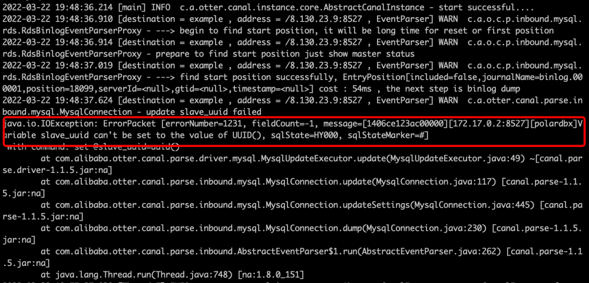

# 使用Kafka订阅PolarDB-X CDC

本小节介绍如何通过Canal订阅PolarDB-X增量数据，投递至Kafka进行消费。

## 演示环境说明

建议通过MacOS或者Linux机器来进行操作。

**环境版本说明：**

| 实例      | 版本说明 | 官方网站                                  |
| :-------- | :------- | :---------------------------------------- |
| PolarDB-X | 2.0.1    | [PolarDB-X](https://polardbx.com/)        |
| Kafka     | 2.13     | [Kafka](https://kafka.apache.org/)        |
| Canal     | 1.1.5    | [Canal](https://github.com/alibaba/canal) |

## 准备PolarDB-X

如果您已经安装了Docker，请执行以下脚本完成单机版PolarDB-X的安装，该过程大概需要1-2分钟。

```bash
# 获取PolarDB-X镜像
docker pull polardbx/polardb-x:2.0.1

# 启动PolarDB-X, 并暴露8527端口, 这里可能需要1-2分钟
docker run -d --name polardbx-play -p 8527:8527 polardbx/polardb-x

# 通过MySQL客户端验证启动
mysql -h127.1 -P8527 -upolardbx_root -p"123456"
```

> **注意**：PolarDB-X集群部署方式有PXD、Kubernetes等，详情请参见[快速入门](../../quickstart/topics/Quick-Start.md)。

## 准备数据

```sql
mysql -h127.1 -P8527 -upolardbx_root -p"123456"

-- 创建测试库
create database canal;

use canal;

-- 创建测试表
create table `trades` (
  id integer auto_increment NOT NULL,
  shop_id integer comment '店铺id',
  pay_amount decimal  comment '支付金额', 
  stat_date date comment '统计时间',
  primary key(id)
);

-- 写入数据
insert trades values(default, 1001, 10, '2022-03-15');
insert trades values(default, 1001, 10, '2022-03-15');
insert trades values(default, 1001, 10, '2022-03-15');
insert trades values(default, 1001, 10, '2022-03-15');
insert trades values(default, 1001, 10, '2022-03-15');
```

## 准备Kafka

下载最新的[Kafka安装包](https://www.apache.org/dyn/closer.cgi?path=/kafka/3.1.0/kafka_2.13-3.1.0.tgz)并解压。启动ZooKeeper和Kafka，等待Kafka服务器启动完成。

```bash
# 解压
tar -xzf kafka_2.13-3.1.0.tgz
cd kafka_2.13-3.1.0

# 启动ZooKeeper
bin/zookeeper-server-start.sh config/zookeeper.properties

# 启动Kafka
bin/kafka-server-start.sh config/server.properties
```

## 准备Canal

#### 下载并安装Canal

下载最新的[Canal安装包](https://github.com/alibaba/canal/releases)。

```bash
# 下载
wget https://github.com/alibaba/canal/releases/download/canal-1.1.5/canal.deployer-1.1.5.tar.gz

# 解压
tar -xzf canal.deployer-1.1.5.tar.gz
```

#### 修改配置文件

Canal的官方配置文件有很多配置项，其中需要改动配置如下：

1. 编辑`vi conf/canal/canal.properties`，用于探测Canal实例配置：

```bash
canal.instance.tsdb.enable = false 
canal.destinations = example
canal.conf.dir = ../conf
# 配置Kafka连接信息
kafka.bootstrap.servers = 127.0.0.1:9092
```


2. 编辑`vi conf/example/instance.properties`，订阅PolarDB-X增量Binlog，并写入Kafka：

```bash
# 配置Canal源为PolarDB-X的连接信息，用于订阅PolarDB-X的Binlog
canal.instance.tsdb.enable=false
canal.instance.master.address=127.0.0.1:8527
canal.instance.dbUsername=polardbx
canal.instance.dbPassword=123456
   
# 定义写入Kafka的topic
canal.mq.topic=example
```


#### 启动Canal

```shell
# 启动Canal
./bin/startup.sh

# 查看Canal日志
tail -f logs/canal/canal.log

# 查看Canal instance日志
tail -f logs/example/example.log
```

> **说明**：如果收到如下图所示的警告信息，可以忽略，不影响正常运行。
>
> 

## 消费Kafka Topic

### Kafka Consumer消费Topic

```bash
# 订阅topic为”example“的消息
bin/kafka-console-consumer.sh --topic example --from-beginning --bootstrap-server localhost:9092
```

**再次写入一些数据：**

```sql
-- 登录PolarDB-X
mysql -h127.1 -P8527 -upolardbx_root -p"123456"

insert trades values(default, 1001, 10, '2022-03-15');
```

### Kafka消息的数据结构示例

```json
{
  "data":[
    {
      "id":"100008",
      "shop_id":"1001",
      "pay_amount":"10",
      "stat_date":"2022-03-15"
    }
  ],
  "database":"canal",
  "es":1647950609000,
  "id":4,
  "isDdl":false,
  "mysqlType":{
    "id":"int(11)",
    "shop_id":"int(11)",
    "pay_amount":"decimal(10,0)",
    "stat_date":"date"
  },
  "old":null, 
  "pkNames":[
    "id"
  ],
  "sql":"",
  "sqlType":{
    "id":4,
    "shop_id":4,
    "pay_amount":3,
    "stat_date":91
  },
  "table":"trades",
  "ts":1647950609988,
  "type":"INSERT"
}
```