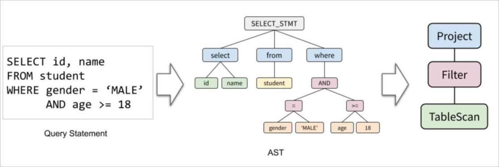
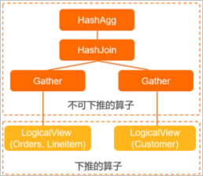

查询优化器介绍 
============================

查询优化器通过优化逻辑计划从而输出物理计划，其主要阶段包含查询改写和计划枚举。本文将会介绍查询优化器的基本原理包含关系代数算子、查询改写（RBO阶段）、查询计划枚举（CBO阶段）。

PolarDB-X接收到一条SQL后的执行过程大致如下：


* 语法解析器（Parser）将SQL文本解析成抽象语法树（AST）。

* 语法树被转化成基于关系代数的逻辑计划。

* 优化器（Optimizer）对逻辑计划进行优化得到物理计划。

* 执行器（Executor）执行该计划，得到查询结果并返回给客户端。


关系代数算子 
---------------------------



一条SQL查询在数据库系统中通常被表示为一棵关系代数算子组成的树，有如下场景的算子：


* Project：用于描述SQL中的SELECT列，包括函数计算。

* Filter：用于描述SQL中的WHERE条件。

* JOIN：用于描述SQL中的JOIN，其对应的物理算子有HashJoin、 BKAJoin、Nested-Loop Join、SortMergeJoin等。

* Agg：用于描述SQL中的Group By及聚合函数，其对应的物理算子有HashAgg、SortAgg。

* Sort：用于描述SQL中的Order By及Limit，其对应的物理算子有TopN、MemSort。

* 其他


例如，对于如下查询SQL：

```sql
SELECT l_orderkey, sum(l_extendedprice *(1 - l_discount)) AS revenue
FROM CUSTOMER, ORDERS, LINEITEM
WHERE c_mktsegment = 'AUTOMOBILE'
  and c_custkey = o_custkey
  and l_orderkey = o_orderkey
  and o_orderdate < '1995-03-13'
  and l_shipdate > '1995-03-13'
GROUP BY l_orderkey;
```


通过如下EXPLAIN命令看到PolarDB-X的执行计划：

```sql
HashAgg(group="l_orderkey", revenue="SUM(*)")
  HashJoin(condition="o_custkey = c_custkey", type="inner")
    Gather(concurrent=true)
      LogicalView(tables="ORDERS_[0-7],LINEITEM_[0-7]", shardCount=8, sql="SELECT `ORDERS`.`o_custkey`, `LINEITEM`.`l_orderkey`, (`LINEITEM`.`l_extendedprice` * (? - `LINEITEM`.`l_discount`)) AS `x` FROM `ORDERS` AS `ORDERS` INNER JOIN `LINEITEM` AS `LINEITEM` ON (((`ORDERS`.`o_orderkey` = `LINEITEM`.`l_orderkey`) AND (`ORDERS`.`o_orderdate` < ?)) AND (`LINEITEM`.`l_shipdate` > ?))")
    Gather(concurrent=true)
      LogicalView(tables="CUSTOMER_[0-7]", shardCount=8, sql="SELECT `c_custkey` FROM `CUSTOMER` AS `CUSTOMER` WHERE (`c_mktsegment` = ?)")
```


用树状图表示如下：



**说明** 左边的LogicalView实际包含了ORDERS和LINEITEM两张表的JOIN。EXPLAIN结果中LogicalView的SQL属性也体现了这一点。

查询改写（RBO） 
------------------------------

查询改写（SQL Rewrite）阶段输入为逻辑执行计划，输出为逻辑执行计划。这一步主要应用一些启发式规则，是基于规则的优化器（Rule-Based Optimizer，简称RBO），所以也常被称为RBO阶段。

查询改写这一步的主要有如下功能：

* 子查询去关联化（Subquery Unnesting）

  子查询去关联化是将含有关联项的子查询（关联子查询）表示为SemiJoin或类似的算子，便于后续的各种优化，例如下推到存储层MySQL或在PolarDB-X层选择某种算法执行。在如下例子中IN子查询转化为SemiJoin算子，并最终转化成SemiHashJoin物理算子由PolarDB-X进行执行：

  ```sql
  > explain  select id from t1 where id in (select id from t2 where t2.name = 'hello');
  SemiHashJoin(condition="id = id", type="semi")
    Gather(concurrent=true)
      LogicalView(tables="t1", shardCount=2, sql="SELECT `id` FROM `t1` AS `t1`")
    Gather(concurrent=true)
      LogicalView(tables="t2_[0-3]", shardCount=4, sql="SELECT `id` FROM `t2` AS `t2` WHERE (`name` = ?)")
  ```

  

* 算子下推 

  算子下推是非常关键的一步，PolarDB-X内置了如下算子的下推优化规则：

  

  |      优化规则       |                             描述                              |
  |-----------------|-------------------------------------------------------------|
  | 谓词下推或列裁剪        | 将Filter及Project算子下推至存储层MySQL执行，过滤掉不需要的行和列。                  |
  | JOIN Clustering | 将JOIN按照拆分方式及拆分键的等值条件进行重排和聚簇，方便下一步的JOIN下推。                   |
  | JOIN下推          | 对于符合条件的JOIN，将其下推至存储层MySQL执行。                                |
  | Agg下推           | 将聚合（Agg）拆分为FinalAgg和LocalAgg两个阶段，并将LocalAgg下推至存储层MySQL。     |
  | Sort下推          | 将排序（Sort）拆分为MergeSort和LocalSort两个阶段，并将LocalSort下推至存储层MySQL。 |

  

  更多关于查询下推的信息，请参见[查询改写与下推](query-rewriting.md)。
  


查询计划枚举（CBO） 
--------------------------------

查询改写阶段输出的逻辑执行计划会被输入到查询计划枚举（Plan Enumerator）中，并输出一个最终的物理执行计划。查询计划枚举在多个可行的查询计划中，根据预先定义的代价模型，选择出代价最低的一个。与查询改写阶段不同，在查询计划枚举中，规则可能产生更好的执行计划，也可能产生更差的执行计划，可以根据算子经过规则优化后的前后代价对比选出较优的那个，因此这也被称为基于代价的优化（Cost-based Optimizer，简称CBO）。

其核心组件有以下几个部分：

* 统计信息（Statistics）

* 基数估计（Cardinality Estimation）

* 转化规则（Transform Rules）

* 代价模型（Cost Model）

* 计划空间搜索引擎（Plan Space Search Engine）


逻辑上，CBO的过程包括如下几个步骤：

1. 搜索引擎利用转化规则，对输入的逻辑执行计划进行变换，构造出物理执行计划的搜索空间。

2. 利用代价模型对搜索空间中的每一个执行计划进行代价估计，选出代价最低的物理执行计划。

3. 代价估计的过程离不开基数估计，它利用各个表、列的统计信息，估算出各算子的输入行数、选择率等信息，提供给算子的代价模型，从而估算出查询计划的代价。


