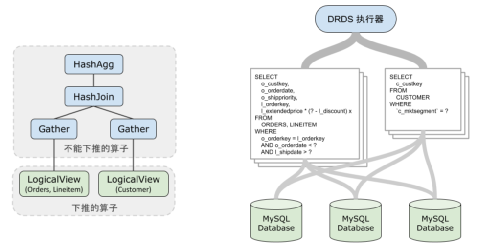

查询执行器介绍 
============================

本文介绍PolarDB-X的SQL执行器如何执行SQL中无法下推的部分。

基本概念 
-------------------------

SQL执行器是PolarDB-X中执行逻辑层算子的组件。对于简单的点查SQL，往往可以整体下推存储层MySQL执行，因而感觉不到执行器的存在，MySQL的结果经过简单的解包封包又被回传给用户。但是对于较复杂的SQL，往往无法将SQL中的算子全部下推，这时候就需要PolarDB-X执行器执行无法下推的计算。

```sql
SELECT l_orderkey, sum(l_extendedprice *(1 - l_discount)) AS revenue
FROM CUSTOMER, ORDERS, LINEITEM
WHERE c_mktsegment = 'AUTOMOBILE'
  and c_custkey = o_custkey
  and l_orderkey = o_orderkey
  and o_orderdate < '1995-03-13'
  and l_shipdate > '1995-03-13'
GROUP BY l_orderkey;
```

通过EXPLAIN命令看到PolarDB-X的执行计划如下：

```sql
HashAgg(group="l_orderkey", revenue="SUM(*)")
  HashJoin(condition="o_custkey = c_custkey", type="inner")
    Gather(concurrent=true)
      LogicalView(tables="ORDERS_[0-7],LINEITEM_[0-7]", shardCount=8, sql="SELECT `ORDERS`.`o_custkey`, `LINEITEM`.`l_orderkey`, (`LINEITEM`.`l_extendedprice` * (? - `LINEITEM`.`l_discount`)) AS `x` FROM `ORDERS` AS `ORDERS` INNER JOIN `LINEITEM` AS `LINEITEM` ON (((`ORDERS`.`o_orderkey` = `LINEITEM`.`l_orderkey`) AND (`ORDERS`.`o_orderdate` < ?)) AND (`LINEITEM`.`l_shipdate` > ?))")
    Gather(concurrent=true)
      LogicalView(tables="CUSTOMER_[0-7]", shardCount=8, sql="SELECT `c_custkey` FROM `CUSTOMER` AS `CUSTOMER` WHERE (`c_mktsegment` = ?)")
```


如下图所示，LogicalView的SQL在执行时被下发给MySQL，而不能下推的部分（除LogicalView以外的算子）由PolarDB-X执行器进行计算，得到最终用户SQL需要的结果。



执行模型 
-------------------------

与传统数据库采用Volcano执行模型不一样，PolarDB-X采样的是Pull\~Push混合执行模型。所有算子按照计算过程中是否需要缓存临时表，将执行过程切分成多个pipeline，pipeline内部采样next()接口，按批获取数据，完成在pipeline内部的计算，pipeline间采用push接口，上游pipeline在计算完成后，会将数据源源不断推送给下游pipeline做计算。下面的例子中，被切分成两个pipeline，在pipeline-A中扫描Table-A数据，完成构建哈希表。Pipeline-B扫描Table-B的数据，然后在HashJoin算子内部做关联得到JOIN结果，再返回客户端。


执行模式 
-------------------------

目前 PolarDB-X 支持了三种执行模式:

* 单机单线程（TP_LOCAL）：查询过程中，是单线程计算，TP负载的查询涉及到的扫描行数比较少，往往会采用这种执行模式，比如基于主键的点查。

* 单机并行（AP_LOCAL）：查询过程中，会利用节点的多核资源做并行计算，如果您没有配置只读实例，针对AP负载的查询，往往会采样这种执行模式，一般也称之为Parallel Query模式。

* 多机并行（MPP）（WIP）：您如果配置了只读实例，针对AP负载的查询，可以协调只读实例上多个节点的多核做分布式多机并行加速。


为了准确知道执行模式，在原有EXPLAIN和执行计划的基础上，扩展了[EXPLAIN PHYSICAL](../../dev-guide/topics/explain.md)例如以下查询，通过指令可以查看当前查询采样的是MPP模式，此外还可以获取到每个执行片段的并发数。

```sql
mysql> explain physical select a.k, count(*) cnt from sbtest1 a, sbtest1 b where a.id = b.k and a.id > 1000 group by k having cnt > 1300 or
der by cnt limit 5, 10;
+-------------------------------------------------------------------------------------------------------------------------------------------------------------------+
| PLAN                                                                                                                                                              |
+-------------------------------------------------------------------------------------------------------------------------------------------------------------------+
| ExecutorType: MPP                                                                                                                                                 |
| The Query's MaxConcurrentParallelism: 2                                                                                                                           |
| Fragment 1                                                                                                                                                        |
|     Shuffle Output layout: [BIGINT, BIGINT] Output layout: [BIGINT, BIGINT]                                                                                       |
|     Output partitioning: SINGLE [] Parallelism: 1                                                                                                                 |
|     TopN(sort="cnt ASC", offset=?2, fetch=?3)                                                                                                                     |
|   Filter(condition="cnt > ?1")                                                                                                                                    |
|     HashAgg(group="k", cnt="COUNT()")                                                                                                                             |
|       BKAJoin(condition="k = id", type="inner")                                                                                                                   |
|         RemoteSource(sourceFragmentIds=[0], type=RecordType(INTEGER_UNSIGNED id, INTEGER_UNSIGNED k))                                                             |
|         Gather(concurrent=true)                                                                                                                                   |
|           LogicalView(tables="[000000-000003].sbtest1_[00-15]", shardCount=16, sql="SELECT `k` FROM `sbtest1` AS `sbtest1` WHERE ((`k` > ?) AND (`k` IN (...)))") |
| Fragment 0                                                                                                                                                        |
|     Shuffle Output layout: [BIGINT, BIGINT] Output layout: [BIGINT, BIGINT]                                                                                       |
|     Output partitioning: SINGLE [] Parallelism: 1 Splits: 16                                                                                                      |
|     LogicalView(tables="[000000-000003].sbtest1_[00-15]", shardCount=16, sql="SELECT `id`, `k` FROM `sbtest1` AS `sbtest1` WHERE (`id` > ?)")                     |
+-------------------------------------------------------------------------------------------------------------------------------------------------------------------+
```


同样的也允许您通过`HINT EXECUTOR_MODE`指定执行模式。比如主实例空闲资源很多，可以考虑强制设置为单机或者多机并行模式来加速。

```sql
mysql> explain physical /*+TDDL:EXECUTOR_MODE=AP_LOCAL*/select a.k, count(*) cnt from sbtest1 a, sbtest1 b where a.id = b.k and a.id > 1000 group by k having cnt > 1300 order by cnt limit 5, 10;                                                                                                                                                     |
+-------------------------------------------------------------------------------------------------------------------------------------------------------------+
| ExecutorMode: AP_LOCAL                                                                                                                                      |
| Fragment 0 dependency: [] parallelism: 4                                                                                                                    |
| BKAJoin(condition="k = id", type="inner")                                                                                                                   |
|   Gather(concurrent=true)                                                                                                                                   |
|     LogicalView(tables="[000000-000003].sbtest1_[00-15]", shardCount=16, sql="SELECT `id`, `k` FROM `sbtest1` AS `sbtest1` WHERE (`id` > ?)")               |
|   Gather(concurrent=true)                                                                                                                                   |
|     LogicalView(tables="[000000-000003].sbtest1_[00-15]", shardCount=16, sql="SELECT `k` FROM `sbtest1` AS `sbtest1` WHERE ((`k` > ?) AND (`k` IN (...)))") |
| Fragment 1 dependency: [] parallelism: 8                                                                                                                    |
| LocalBuffer                                                                                                                                                 |
|   RemoteSource(sourceFragmentIds=[0], type=RecordType(INTEGER_UNSIGNED id, INTEGER_UNSIGNED k, INTEGER_UNSIGNED k0))                                        |
| Fragment 2 dependency: [0, 1] parallelism: 8                                                                                                                |
| Filter(condition="cnt > ?1")                                                                                                                                |
|   HashAgg(group="k", cnt="COUNT()")                                                                                                                         |
|     RemoteSource(sourceFragmentIds=[1], type=RecordType(INTEGER_UNSIGNED id, INTEGER_UNSIGNED k, INTEGER_UNSIGNED k0))                                      |
| Fragment 3 dependency: [0, 1] parallelism: 1                                                                                                                |
| LocalBuffer                                                                                                                                                 |
|   RemoteSource(sourceFragmentIds=[2], type=RecordType(INTEGER_UNSIGNED k, BIGINT cnt))                                                                      |
| Fragment 4 dependency: [2, 3] parallelism: 1                                                                                                                |
| TopN(sort="cnt ASC", offset=?2, fetch=?3)                                                                                                                   |
|   RemoteSource(sourceFragmentIds=[3], type=RecordType(INTEGER_UNSIGNED k, BIGINT cnt))                                                                      |
+-------------------------------------------------------------------------------------------------------------------------------------------------------------+
```


在多机并行MPP执行模式的并发度是根据物理扫描行数、实例规格和计算所涉及到表的分表数来计算出来的，整体的并行度要考虑高并发场景，所以并行度的计算会偏保守，您可以通过上述`EXPLAIN PHYSICAL`指令查看并行度。也同样支持`HINT MPP_PARALLELISM`强制指定并行度。

```sql
/*+TDDL:EXECUTOR_MODE=MPP MPP_PARALLELISM=8*/select a.k, count(*) cnt from sbtest1 a, sbtest1 b where a.id = b.k and a.id > 1000 group by k having cnt > 1300 order by cnt limit 5, 10;
```


