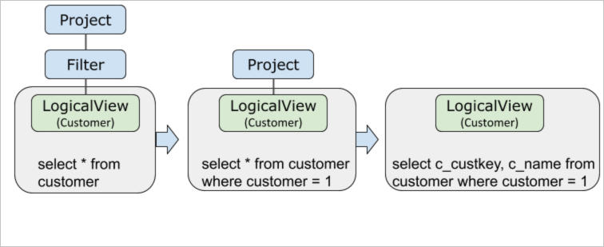
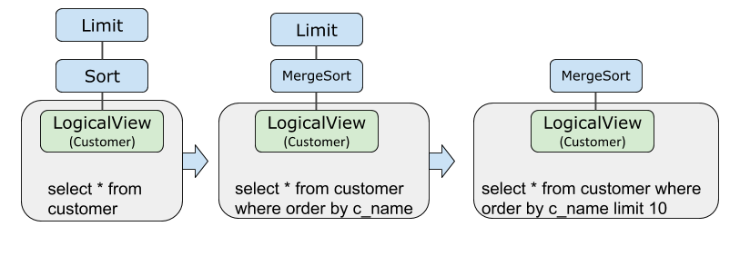
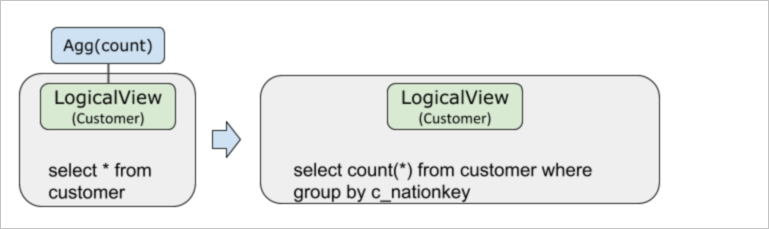
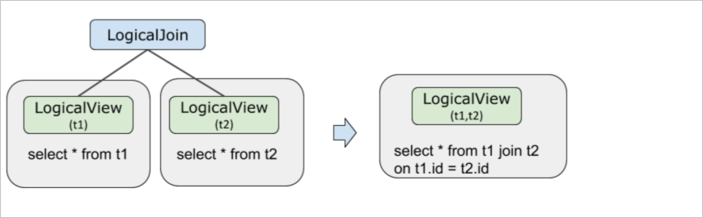

查询改写与下推 
============================

下推是查询改写的一项重要优化，利用PolarDB-X的拆分信息来优化执行计划，使得算子尽量下推以达到提前过滤数据、减少网络传输、并行计算等目的。

背景信息 
-------------------------

根据PolarDB-X的SQL语句优化的基本原则，可以下推尽量更多的计算到存储层MySQL上执行。可下推计算主要包括：

* JOIN连接

* 过滤条件（如`WHERE`或`HAVING`）

* 计算（如`COUNT`、`GROUP BY`）

* 排序（如`ORDER BY`）

* 去重（如`DISTINCT`）

* 函数计算（如`NOW()`函数）

* 子查询


通过explain optimizer + sql可以看到查询改写的具体过程。

Project和Filter下推 
-------------------------------------

一条SQL的执行计划在如下生成过程中，Filter和Project被先后下推到LogicalView算子里面。Filter和Project下推可以达到提前过滤数据，减少网络传输等效果。

```sql
mysql> explain optimizer select c_custkey,c_name from customer where c_custkey = 1;
```

其中c_custkey是分区键。



Limit和Sort下推 
---------------------------------

一条SQL的执行计划在如下生成过程中，Sort和Limit被先后下推到LogicalView算子里面。Sort和Limit下推可以达到提前过滤数据，减少网络传输、并行执行、减少PolarDB-X内存占用等效果。

```sql
mysql> explain optimizer select * from customer order by c_name limit 10
```



Agg下推
---------------------------------

一条SQL的执行计划在如下生成过程中，Agg被下推到LogicalView算子里面。

Agg下推可以达到提前过滤数据，减少网络传输，并行执行，减少PolarDB-X内存占用等效果。

```sql
explain optimizer select count(*) from customer group by c_nationkey;
```

当分区键为c_nationkey情况：



拆分键不为c_nationkey情况：


JOIN下推 
---------------------------

JOIN下推需要满足以下条件：

* t1与t2表的拆分方式一致（包括分库键、分表键、拆分函数、分库分表数目）。

* JOIN条件中包含t1，t2表拆分键的等值关系。此外，任意表JOIN广播表总是可以下推。


```sql
mysql> explain optimizer select * from t1, t2 where t1.id = t2.id;
```


一条SQL的执行计划在如下生成过程中，JOIN下推到LogicalView算子里面。JOIN下推可以达到计算离存储更近，并行执行加速的效果。



JoinClustering 
-----------------------------------

当有多个表执行JOIN操作时，PolarDB-X会通过join clustering的优化技术将JOIN进行重排序，将可下推的JOIN放到相邻的位置，从而让它可以被正常下推。示例如下：

假设原JOIN顺序为t2、t1、l2, 经过重排序之后，t2和l2的JOIN操作依然能下推到LogicalView。SQL复制代码

```sql
mysql> explain select t2.id from t2 join t1 on t2.id = t1.id join l2 on t1.id = l2.id;
Project(id="id")
  HashJoin(condition="id = id AND id = id0", type="inner")
    Gather(concurrent=true)
      LogicalView(tables="t2_[0-3],l2_[0-3]", shardCount=4, sql="SELECT `t2`.`id`, `l2`.`id` AS `id0` FROM `t2` AS `t2` INNER JOIN `l2` AS `l2` ON (`t2`.`id` = `l2`.`id`) WHERE (`t2`.`id` = `l2`.`id`)")
    Gather(concurrent=true)
      LogicalView(tables="t1", shardCount=2, sql="SELECT `id` FROM `t1` AS `t1`")
```


子查询下推 
--------------------------

一条SQL的执行计划在如下生成过程中，子查询下推到`LogicalView`算子里面。子查询下推可以达到计算离存储更近，并行执行加速的效果。

1. 子查询会先被转换成`Semi Join`或`Anti Join`

2. 如果满足上节中JOIN下推的判断条件，就会将`Semi Join`或`Anti Join`下推至`LogicalView`

3. 下推后的`Semi Join`或`Anti Join`会被还原为子查询。


```sql
explain optimizer select * from t1 where id in (select id from t2);
```


