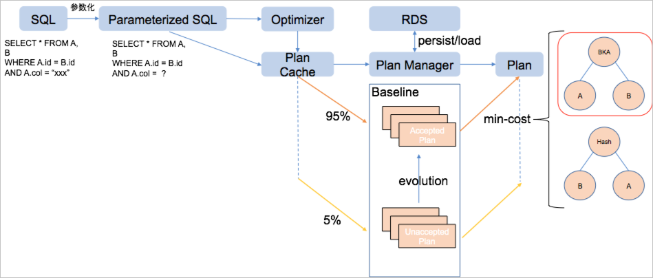

执行计划管理 
===========================

本文介绍如何管理执行计划，将重复或者复杂查询的执行计划长久地保存下来。

背景信息 
-------------------------

对于每一条SQL，优化器都会生成相应执行计划。但是很多情况下，应用请求的SQL都是重复的（仅参数不同），参数化之后的SQL完全相同。这时，可以按照参数化之后的SQL构造一个缓存，将除了参数以外的各种信息（比如执行计划）缓存起来，称为执行计划缓存（Plan Cache）。

另一方面，对于较复杂的查询（例如涉及到多个表的Join），为了使其执行计划能保持相对稳定，不因为版本升级等原因发生变化。执行计划管理（Plan Management）为每个SQL记录一组执行计划，该执行计划会被持久化地保存，即使版本升级也会保留。

工作流程概览 
---------------------------

当PolarDB-X收到一条查询SQL时，会经历以下流程：

1. 对查询SQL进行参数化处理，将所有参数替换为占位符 **？** 

2. 以参数化的SQL作为Key，查找执行计划缓存中是否有缓存；如果没有，则调用优化器进行优化。

3. 如果该SQL是简单查询，则直接执行，跳过执行计划管理相关步骤。

4. 如果该SQL是复杂查询，则使用基线（Baseline）中固化的执行计划；如果有多个，则选择代价最低的那个。




执行计划缓存 
---------------------------

PolarDB-X默认开启执行计划缓存功能。EXPLAIN结果中的HitCache表示当前SQL是否命中执行计划缓存。开启执行计划缓存后，PolarDB-X会对SQL做参数化处理，参数化会将SQL中的常量用占位符?替换，并构建出相应的参数列表。在执行计划中也可以看到LogicalView算子的SQL中含有?。


执行计划管理 
---------------------------

对于复杂SQL，经过执行计划缓存之后，还会经过执行计划管理流程。

执行计划缓存和执行计划管理都是采用参数化后的SQL作为Key来执行计划。执行计划缓存中会缓存所有SQL的执行计划，而执行计划管理仅对复杂查询SQL进行处理。由于受到具体参数的影响，SQL模版和最优的执行计划并非一一对应的。

在执行计划管理中，每一条SQL对应一个基线，每个基线中包含一个或多个执行计划。实际使用中，会根据当时的参数选择其中代价最小的执行计划来执行。当执行计划缓存中的执行计划走进执行计划管理时，SPM会操作一个流程判断该执行计划是否是已知的，是已知的话，是否代价是最小的；不是已知的话，是否需要执行一下以判断该执行计划的优化程度。


**运维指令** 

PolarDB-X提供了丰富的指令集用于管理执行计划，语法如下：

```sql
BASELINE (LOAD|PERSIST|CLEAR|VALIDATE|LIST|DELETE) [Signed Integer,Signed Integer....]
BASELINE (ADD|FIX) SQL (HINT Select Statemtnt)
```


* BASELINE (ADD&#124;FIX) SQL \<HINT\> \<Select Statement\>：将SQL以HINT修复过后的执行计划记录固定下来。

* BASELINE LOAD：将系统表中指定的基线信息刷新到内存并使其生效。

* BASELINE LOAD_PLAN：将系统表中指定的执行计划信息刷新到内存并使其生效。

* BASELINE LIST：列出当前所有的基线信息。

* BASELINE PERSIST：将指定的基线落盘。

* BASELINE PERSIST_PLAN：将指定的执行计划落盘。

* BASELINE CLEAR：内存中清理某个基线。

* BASELINE CLEAR_PLAN：内存中清理某个执行计划。

* BASELINE DELETE：磁盘中删除某个基线。

* BASELINE DELETE_PLAN：磁盘中删除某个执行计划。


**执行计划调优实战** 

数据发生变化或PolarDB-X优化器引擎升级后，针对同一条SQL，有可能会出现更好的执行计划。SPM在自动演化时会将CBO优化自动发现的更优执行计划加入到SQL的基线中。除此以外，您也可以通过SPM的指令主动优化执行计划。

```sql
SELECT *
FROM lineitem JOIN part ON l_partkey=p_partkey
WHERE p_name LIKE '%green%';
```

正常EXPLAIN发现该SQL生成的执行计划使用的是Hash Join，并且在Baseline List的基线中，该SQL仅有这一个执行计划：

```sql
mysql> explain select * from lineitem join part on l_partkey=p_partkey where p_name like '%geen%';
+----------------------------------------------------------------------------------------------------------------------------------------------------------------------------------------------------------------------------------------------------------------------------------------------------------------------------------------------------------------+
| LOGICAL PLAN                                                                                                                                                                                                                                                                                                                                                   |
+----------------------------------------------------------------------------------------------------------------------------------------------------------------------------------------------------------------------------------------------------------------------------------------------------------------------------------------------------------------+
| Gather(parallel=true)                                                                                                                                                                                                                                                                                                                                          |
|   ParallelHashJoin(condition="l_partkey = p_partkey", type="inner")                                                                                                                                                                                                                                                                                            |
|     LogicalView(tables="[00-03].lineitem", shardCount=4, sql="SELECT `l_orderkey`, `l_partkey`, `l_suppkey`, `l_linenumber`, `l_quantity`, `l_extendedprice`, `l_discount`, `l_tax`, `l_returnflag`, `l_linestatus`, `l_shipdate`, `l_commitdate`, `l_receiptdate`, `l_shipinstruct`, `l_shipmode`, `l_comment` FROM `lineitem` AS `lineitem`", parallel=true) |
|     LogicalView(tables="[00-03].part", shardCount=4, sql="SELECT `p_partkey`, `p_name`, `p_mfgr`, `p_brand`, `p_type`, `p_size`, `p_container`, `p_retailprice`, `p_comment` FROM `part` AS `part` WHERE (`p_name` LIKE ?)", parallel=true)                                                                                                                    |
| HitCache:true                                                                                                                                                                                                                                                                                                                                                  |
|                                                                                                                                                                                                                                                                                                                                                                |
|                                                                                                                                                                                                                                                                                                                                                                |
+----------------------------------------------------------------------------------------------------------------------------------------------------------------------------------------------------------------------------------------------------------------------------------------------------------------------------------------------------------------+
7 rows in set (0.06 sec)
mysql> baseline list;
+-------------+--------------------------------------------------------------------------------+------------+--------------------------------------------------------------------------------------------------------------------------------------------------------------------------------------------------------------------------------------------------------------------------------------------------------------------------------------------------------------------------------------------------------------------------------------------------------------------------------------------------------------------------------------------------------------------------------------------------------------------------------------------------------------------------------------------------------+-------+----------+
| BASELINE_ID | PARAMETERIZED_SQL                                                              | PLAN_ID    | EXTERNALIZED_PLAN                                                                                                                                                                                                                                                                                                                                                                                                                                                                                                                                                                                                                                                                                      | FIXED | ACCEPTED |
+-------------+--------------------------------------------------------------------------------+------------+--------------------------------------------------------------------------------------------------------------------------------------------------------------------------------------------------------------------------------------------------------------------------------------------------------------------------------------------------------------------------------------------------------------------------------------------------------------------------------------------------------------------------------------------------------------------------------------------------------------------------------------------------------------------------------------------------------+-------+----------+
|  -399023558 | SELECT *
FROM lineitem
    JOIN part ON l_partkey = p_partkey
WHERE p_name LIKE ? | -935671684 |
Gather(parallel=true)
  ParallelHashJoin(condition="l_partkey = p_partkey", type="inner")
    LogicalView(tables="[00-03].lineitem", shardCount=4, sql="SELECT `l_orderkey`, `l_partkey`, `l_suppkey`, `l_linenumber`, `l_quantity`, `l_extendedprice`, `l_discount`, `l_tax`, `l_returnflag`, `l_linestatus`, `l_shipdate`, `l_commitdate`, `l_receiptdate`, `l_shipinstruct`, `l_shipmode`, `l_comment` FROM `lineitem` AS `lineitem`", parallel=true)
    LogicalView(tables="[00-03].part", shardCount=4, sql="SELECT `p_partkey`, `p_name`, `p_mfgr`, `p_brand`, `p_type`, `p_size`, `p_container`, `p_retailprice`, `p_comment` FROM `part` AS `part` WHERE (`p_name` LIKE ?)", parallel=true)
 |     0 |        1 |
+-------------+--------------------------------------------------------------------------------+------------+--------------------------------------------------------------------------------------------------------------------------------------------------------------------------------------------------------------------------------------------------------------------------------------------------------------------------------------------------------------------------------------------------------------------------------------------------------------------------------------------------------------------------------------------------------------------------------------------------------------------------------------------------------------------------------------------------------+-------+----------+
1 row in set (0.02 sec)
```

假如这个SQL在某些条件下采用BKA Join（Lookup Join）会有更好的性能，那么首先需要想办法利用HINT引导PolarDB-X生成符合预期的执行计划。BKA Join的HINT格式为：

```sql
/*+TDDL:BKA_JOIN(lineitem, part)*/
```

通过`EXPLAIN [HINT] [SQL]`观察出来的执行计划是否符合预期：

```sql
mysql> explain /*+TDDL:bka_join(lineitem, part)*/ select * from lineitem join part on l_partkey=p_partkey where p_name like '%geen%';
+----------------------------------------------------------------------------------------------------------------------------------------------------------------------------------------------------------------------------------------------------------------------------------------------------------------------------------------------------------------+
| LOGICAL PLAN                                                                                                                                                                                                                                                                                                                                                   |
+----------------------------------------------------------------------------------------------------------------------------------------------------------------------------------------------------------------------------------------------------------------------------------------------------------------------------------------------------------------+
| Gather(parallel=true)                                                                                                                                                                                                                                                                                                                                          |
|   ParallelBKAJoin(condition="l_partkey = p_partkey", type="inner")                                                                                                                                                                                                                                                                                             |
|     LogicalView(tables="[00-03].lineitem", shardCount=4, sql="SELECT `l_orderkey`, `l_partkey`, `l_suppkey`, `l_linenumber`, `l_quantity`, `l_extendedprice`, `l_discount`, `l_tax`, `l_returnflag`, `l_linestatus`, `l_shipdate`, `l_commitdate`, `l_receiptdate`, `l_shipinstruct`, `l_shipmode`, `l_comment` FROM `lineitem` AS `lineitem`", parallel=true) |
|     Gather(concurrent=true)                                                                                                                                                                                                                                                                                                                                    |
|       LogicalView(tables="[00-03].part", shardCount=4, sql="SELECT `p_partkey`, `p_name`, `p_mfgr`, `p_brand`, `p_type`, `p_size`, `p_container`, `p_retailprice`, `p_comment` FROM `part` AS `part` WHERE (`p_name` LIKE ?)")                                                                                                                                 |
| HitCache:false                                                                                                                                                                                                                                                                                                                                                 |
|                                                                                                                                                                                                                                                                                                                                                                |
|                                                                                                                                                                                                                                                                                                                                                                |
+----------------------------------------------------------------------------------------------------------------------------------------------------------------------------------------------------------------------------------------------------------------------------------------------------------------------------------------------------------------+
8 rows in set (0.14 sec)
```

此时由于Hint的干预，Join的算法已修正为BKA Join。但是这并不会对基线造成变动，如果想以后每次遇到这条SQL都使用上面的计划，还需要将其加入到基线中。

可以采用执行计划管理的Baseline Add指令为该SQL增加一个执行计划。这样就会同时有两套执行计划存在于该SQL的基线中，CBO优化器会根据代价选择一个执行计划执行。

```sql
mysql> baseline add sql /*+TDDL:bka_join(lineitem, part)*/ select * from lineitem join part on l_partkey=p_partkey where p_name like '%geen%';
+-------------+--------+
| BASELINE_ID | STATUS |
+-------------+--------+
|  -399023558 | OK     |
+-------------+--------+
1 row in set (0.09 sec)
mysql> baseline list;
+-------------+--------------------------------------------------------------------------------+-------------+----------------------------------------------------------------------------------------------------------------------------------------------------------------------------------------------------------------------------------------------------------------------------------------------------------------------------------------------------------------------------------------------------------------------------------------------------------------------------------------------------------------------------------------------------------------------------------------------------------------------------------------------------------------------------------------------------------------------+-------+----------+
| BASELINE_ID | PARAMETERIZED_SQL                                                              | PLAN_ID     | EXTERNALIZED_PLAN                                                                                                                                                                                                                                                                                                                                                                                                                                                                                                                                                                                                                                                                                                    | FIXED | ACCEPTED |
+-------------+--------------------------------------------------------------------------------+-------------+----------------------------------------------------------------------------------------------------------------------------------------------------------------------------------------------------------------------------------------------------------------------------------------------------------------------------------------------------------------------------------------------------------------------------------------------------------------------------------------------------------------------------------------------------------------------------------------------------------------------------------------------------------------------------------------------------------------------+-------+----------+
|  -399023558 | SELECT *
FROM lineitem
    JOIN part ON l_partkey = p_partkey
WHERE p_name LIKE ? | -1024543942 |
Gather(parallel=true)
  ParallelBKAJoin(condition="l_partkey = p_partkey", type="inner")
    LogicalView(tables="[00-03].lineitem", shardCount=4, sql="SELECT `l_orderkey`, `l_partkey`, `l_suppkey`, `l_linenumber`, `l_quantity`, `l_extendedprice`, `l_discount`, `l_tax`, `l_returnflag`, `l_linestatus`, `l_shipdate`, `l_commitdate`, `l_receiptdate`, `l_shipinstruct`, `l_shipmode`, `l_comment` FROM `lineitem` AS `lineitem`", parallel=true)
    Gather(concurrent=true)
      LogicalView(tables="[00-03].part", shardCount=4, sql="SELECT `p_partkey`, `p_name`, `p_mfgr`, `p_brand`, `p_type`, `p_size`, `p_container`, `p_retailprice`, `p_comment` FROM `part` AS `part` WHERE (`p_name` LIKE ?)")
 |     0 |        1 |
|  -399023558 | SELECT *
FROM lineitem
    JOIN part ON l_partkey = p_partkey
WHERE p_name LIKE ? |  -935671684 |
Gather(parallel=true)
  ParallelHashJoin(condition="l_partkey = p_partkey", type="inner")
    LogicalView(tables="[00-03].lineitem", shardCount=4, sql="SELECT `l_orderkey`, `l_partkey`, `l_suppkey`, `l_linenumber`, `l_quantity`, `l_extendedprice`, `l_discount`, `l_tax`, `l_returnflag`, `l_linestatus`, `l_shipdate`, `l_commitdate`, `l_receiptdate`, `l_shipinstruct`, `l_shipmode`, `l_comment` FROM `lineitem` AS `lineitem`", parallel=true)
    LogicalView(tables="[00-03].part", shardCount=4, sql="SELECT `p_partkey`, `p_name`, `p_mfgr`, `p_brand`, `p_type`, `p_size`, `p_container`, `p_retailprice`, `p_comment` FROM `part` AS `part` WHERE (`p_name` LIKE ?)", parallel=true)
               |     0 |        1 |
+-------------+--------------------------------------------------------------------------------+-------------+----------------------------------------------------------------------------------------------------------------------------------------------------------------------------------------------------------------------------------------------------------------------------------------------------------------------------------------------------------------------------------------------------------------------------------------------------------------------------------------------------------------------------------------------------------------------------------------------------------------------------------------------------------------------------------------------------------------------+-------+----------+
2 rows in set (0.03 sec)
```


通过以上`Baseline List`指令展示出来的结果，可以看到基于BKA_JOIN的执行计划已增加到该 SQL的基线中。此时EXPLAIN这条SQL，发现随SQL中`p_name LIKE ? `条件变化，PolarDB-X会选择不同的执行计划。如果想让PolarDB-X固定使用上述的执行计划（而非在两个中挑选一个），可以采用`Baseline Fix`指令强制PolarDB-X走指定的执行计划。

```sql
mysql> baseline fix sql /*+TDDL:bka_join(lineitem, part)*/ select * from lineitem join part on l_partkey=p_partkey where p_name like '%geen%';
+-------------+--------+
| BASELINE_ID | STATUS |
+-------------+--------+
|  -399023558 | OK     |
+-------------+--------+
1 row in set (0.07 sec)
mysql> baseline list\G
*************************** 1. row ***************************
      BASELINE_ID: -399023558
PARAMETERIZED_SQL: SELECT *
FROM lineitem
    JOIN part ON l_partkey = p_partkey
WHERE p_name LIKE ?
          PLAN_ID: -1024543942
EXTERNALIZED_PLAN:
Gather(parallel=true)
  ParallelBKAJoin(condition="l_partkey = p_partkey", type="inner")
    LogicalView(tables="[00-03].lineitem", shardCount=4, sql="SELECT `l_orderkey`, `l_partkey`, `l_suppkey`, `l_linenumber`, `l_quantity`, `l_extendedprice`, `l_discount`, `l_tax`, `l_returnflag`, `l_linestatus`, `l_shipdate`, `l_commitdate`, `l_receiptdate`, `l_shipinstruct`, `l_shipmode`, `l_comment` FROM `lineitem` AS `lineitem`", parallel=true)
    Gather(concurrent=true)
      LogicalView(tables="[00-03].part", shardCount=4, sql="SELECT `p_partkey`, `p_name`, `p_mfgr`, `p_brand`, `p_type`, `p_size`, `p_container`, `p_retailprice`, `p_comment` FROM `part` AS `part` WHERE (`p_name` LIKE ?)")
            FIXED: 1
         ACCEPTED: 1
*************************** 2. row ***************************
      BASELINE_ID: -399023558
PARAMETERIZED_SQL: SELECT *
FROM lineitem
    JOIN part ON l_partkey = p_partkey
WHERE p_name LIKE ?
          PLAN_ID: -935671684
EXTERNALIZED_PLAN:
Gather(parallel=true)
  ParallelHashJoin(condition="l_partkey = p_partkey", type="inner")
    LogicalView(tables="[00-03].lineitem", shardCount=4, sql="SELECT `l_orderkey`, `l_partkey`, `l_suppkey`, `l_linenumber`, `l_quantity`, `l_extendedprice`, `l_discount`, `l_tax`, `l_returnflag`, `l_linestatus`, `l_shipdate`, `l_commitdate`, `l_receiptdate`, `l_shipinstruct`, `l_shipmode`, `l_comment` FROM `lineitem` AS `lineitem`", parallel=true)
    LogicalView(tables="[00-03].part", shardCount=4, sql="SELECT `p_partkey`, `p_name`, `p_mfgr`, `p_brand`, `p_type`, `p_size`, `p_container`, `p_retailprice`, `p_comment` FROM `part` AS `part` WHERE (`p_name` LIKE ?)", parallel=true)
            FIXED: 0
         ACCEPTED: 1
2 rows in set (0.01 sec)
```


`Baseline Fix`指令执行完后，可以看到BKA Join执行计划的`Fix`状态位已被置为1。此时就算不加HINT，任意条件下Explain这条SQL，都一定会采用这个执行计划。

```sql
mysql> explain select * from lineitem join part on l_partkey=p_partkey where p_name like '%green%';
+----------------------------------------------------------------------------------------------------------------------------------------------------------------------------------------------------------------------------------------------------------------------------------------------------------------------------------------------------------------+
| LOGICAL PLAN                                                                                                                                                                                                                                                                                                                                                   |
+----------------------------------------------------------------------------------------------------------------------------------------------------------------------------------------------------------------------------------------------------------------------------------------------------------------------------------------------------------------+
| Gather(parallel=true)                                                                                                                                                                                                                                                                                                                                          |
|   ParallelBKAJoin(condition="l_partkey = p_partkey", type="inner")                                                                                                                                                                                                                                                                                             |
|     LogicalView(tables="[00-03].lineitem", shardCount=4, sql="SELECT `l_orderkey`, `l_partkey`, `l_suppkey`, `l_linenumber`, `l_quantity`, `l_extendedprice`, `l_discount`, `l_tax`, `l_returnflag`, `l_linestatus`, `l_shipdate`, `l_commitdate`, `l_receiptdate`, `l_shipinstruct`, `l_shipmode`, `l_comment` FROM `lineitem` AS `lineitem`", parallel=true) |
|     Gather(concurrent=true)                                                                                                                                                                                                                                                                                                                                    |
|       LogicalView(tables="[00-03].part", shardCount=4, sql="SELECT `p_partkey`, `p_name`, `p_mfgr`, `p_brand`, `p_type`, `p_size`, `p_container`, `p_retailprice`, `p_comment` FROM `part` AS `part` WHERE (`p_name` LIKE ?)")                                                                                                                                 |
| HitCache:true                                                                                                                                                                                                                                                                                                                                                  |
+----------------------------------------------------------------------------------------------------------------------------------------------------------------------------------------------------------------------------------------------------------------------------------------------------------------------------------------------------------------+
8 rows in set (0.01 sec)
```


