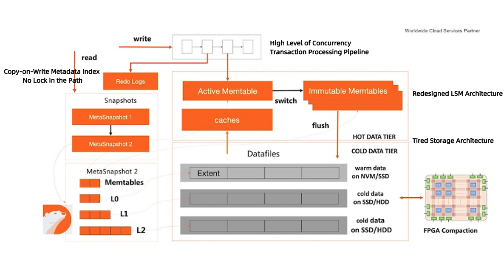

# 2. X-Engine Overview

# X-Engine Introduction

## 1. What is X-Engine?

X-Engine is a MySQL transaction storage engine based on the LSM-tree architecture. It is developed and maintained by Alibaba Cloud.

At present, X-Engine is for sale on Alibaba Cloud official website in two product forms:

- [ApsaraDB for RDS](https://www.alibabacloud.com/help/en/doc-detail/148660.html) provides services using the standalone MySQL storage engine.
- [PolarDB for MySQL](https://www.alibabacloud.com/help/en/doc-detail/195661.htm#concept-2010571) provides services using X-Engine with a primary node and at least two read-only nodes.

Codes of the open-source X-Engine are exactly the same as those of RDS MySQL X-Engine. Considering that deploying an offline instance sharing the storage among the primary node and read-only nodes requires many dependencies, this version is not open-sourced for the present.

## 2. Why we develop X-Engine?

At the business level, Alibaba's business data has been growing exponentially year by year since 2016. According to the data growth trend at that time, patching MySQL InnoDB is not a long-term strategy.

At first, X-Engine is aimed to be a better transaction storage engine and replace the InnoDB engine that is widely used inside Alibaba. At the business level, 

At the technical level, it is impossible for the official developers of MySQL to customize the product to only meet Alibaba's business requirements. Meanwhile, Alibaba's developers will pay a high price if they modify over 200,000 codes of the InnoDB engine to satisfy the demands.

Finally, we decided to choose a more suitable technical route to solve the business problem we were faced with at that time. Our choice is the LSM-tree architecture which has been researched and accumulated in academia and industry for years.

## 3. Relationship between X-Engine and RocksDB

Codes of the first version of X-Engine are based on those of RocksDB 4.8.1 which is released in July, 2016. That is to say, X-Engine is not developed from scratch.

Selecting the code based on RocksDB as the foundation to develop X-Engine was suitable for the engineering capabilities of team members at that time. With an excellent blueprint as a reference, we can explore and study many technologies at the same time, including index, space management, high-performance index, and high-performance transactional processing framework, without worrying about the problem that functions developed by different people cannot be assembled for working together later. On the other hand, we can reuse APIs of MyRocks to make X-Engine adapt to MySQL operation. In this way, we can concentrate on the optimization of capabilities of the store engine's core.

Since 2016, X-Engine has been evolving independently for almost 6 years. In the past 6 years, most core modules have been rewritten. Now the design ideas of most modules are quite different from RocksDB except for the storage engine APIs that remain consistent with those of RocksDB. According to the scanning result, 70% of the codes are proprietary.

## 4. X-Engine Technology

For details about X-Engine, refer to [Introduction to X-Engine](https://www.alibabacloud.com/help/en/doc-detail/148660.html). Here is a summary of technologies in X-Engine.

- It uses the typical LSM-tree architecture including incremental modifications on the memory and all data in the disk.
- For write operations, we use the asynchronous transaction pipeline technology, which can prevent a large amount of synchronous operations in the transaction processing process and increase the write throughput.
- The compaction takes Extent/Page as the unit. Therefore, it can implement high concurrency with small tasks and reduce the impact on the front end. The compaction supports data reuse at the Extent/Page granularity to avoid data migration and copying.
- The data in a disk is often grouped into two tiers: L1 storing hot data and L2 storing cold data. Few tiers can help us get better read performance. Files in the disk are managed by FILE(1GB), Extent(2MB), or Page(16KB). The data will be compressed for storage by default and the compression rate can be 3 to 5.  The storage capacity can be automatically scaled out or scaled in.
- The management of hot and cold data is fine-grained. It supports actively pre-warming cache after flush/compaction and scheduling compaction according to hot and cold features.
- It is fully compatible with MySQL, supports the Chinese character set, supports Online/Instant/Parallel DDL, and supports xtrabackup physical backup.

### 4.1 X-Engine as MySQL Storage Engine

Inside Alibaba, X-Engine is mainly used as the storage engine of MySQL. Therefore, we put a lot of effort into MySQL to meet requirements of various businesses.

In most cases, you can directly replace the InnoDB engine with X-Engine, which can help you save storage usage by 50% to 90%. For the differences between them, refer to [Differences between X-Engine and InnoDB](https://www.alibabacloud.com/help/en/doc-detail/148404.html).

- X-Engine supports MySQL 5.0/8.0. The open-sourced X-Engine is based on MySQL 8.0, which is also the main version inside Alibaba. X-Engine based on MySQL 5.7 has stopped evolving.
- It supports DDL optimization including Instant DDL, Online DDL, and Parallel DDL, which helps optimize user experience during schema changes of a large table.
- It supports sound statistics information management, including table information (data size of the table, number of entries in the table, and average row size), index information (index size and index key size), index column distribution information (NDV, Number of Distinct Values), and so on, to help the optimizer choose the optimal execution plan.
- It supports back up and restore physical data using xtrabackup. Currently this functions is not open sourced.
- It supports many character sets, such as GBK (Chinese) and UTF8MB4.

### 4.2 Transaction System and Index Design

- The transaction submission process of the LSM-tree engine is the most complex step in the transaction operation. X-Engine divides the transaction submission process into small phases, uses the pipeline method for scheduling, and combines asynchronous submission and thread decoupling to achieve extremely high throughput. Combining AsyncCommit in the KV API, the write ops can be up to 2,000,000/s.
- Besides the skiplist of RocksDB, X-Engine also provides a variant of ART index as the default index of the memory table, which can achieve better Point/Range read/write performance in the scenario in which only memory is used for computing.
- Due to the structure characteristics of the memory table, LSM-tree may accumulate more WAL logs requiring checkpoints compared with InnoDB. This problem is more obvious when the read/write load is not balanced among all tables. To speed up restarting the system during recovery after it crashed, X-Engine supports replaying WAL logs in parallel during crash recovery.
- Unlike RocksDB in which switching and flushing Memtable is triggered by write operations, X-Engine supports flushing Memtable and generating checkpoints when the system is idle.

### 4.3 LSM-tree Structure and Compaction System

Compared with RocksDB, X-Engine emphasizes the read optimization. Therefore, the tier structure of X-Engine is much shallower and the entire compaction system is designed and optimized for the shallow LSM-tree architecture.

- The disk data of X-Engine contains persistent L1 and L2 and temporary L0. The design concept is as follows: all cold data is stored in L2, hot data that is frequently read and written is stored in L1, and data dumped by the memory table is stored in L0 temporarily when the compaction cannot be executed in time. When the system load is low, data in L0 will be compacted and stored on the disk with that in L1.
- As the data is stored in the extent of 2 MB in size, data in L1 and compaction in L2 can be based on the scheduling strategy triggered by the read/write frequency. In this way, hot data can be stored in L1 as much as possible to improve the IO efficiency when the system reads the data from the disk.
- The compaction of X-Engine is a proprietary technology that we devoted ourselves to:
  - The Compaction supports data reuse. In most real business scenarios, data use can greatly reduce the consumption of I/O and computing resources.
  - Compared with RocksDB, the compaction of X-Engine supports executing multiple small tasks in parallel inside the system, which is more fine-grained and can increase the task parallelism.
  - X-Engine supports scheduling compaction tasks when idle. That is to say, X-Engine will trigger compaction tasks as many as possible when the system load is low and adjust the LSM-tree to the optimal state.
  - To further optimize the performance of Compaction, we have tried to use FPGA for acceleration. For details, refer to [FPGA-Accelerated Compactions for LSM-based Key-Value Store](https://www.usenix.org/system/files/fast20-zhang_teng.pdf).

### 4.4 Cache System

- The cache system of X-Engine consists of three layers: Memtable, RowCache, and BlockCache. Among them, Memtable contains data written recently, RowCache is usually configured with at least 5% of the memory and uses hash index to accelerate the point queries, and BlockCache caches the page-level data on the disk.
- Due to the architecture characteristics, LSM-tree will trigger the edition change when it flushes Memtable to the disk or executes compaction, which will cause active cache invalidation and afterwards a performance jitter. X-Engine supports actively refilling cache according to the access statistics of the memory data after flushing Memtable to the disk and executing compaction, which can help reduce the cache jitter as much as possible.
- Further more, we even have tried a machine learning method to prefetch data in the LSM-tree based storage engine into caches and expected to completely eliminate the effects of cache misses. For details, refer to [Leaper: A Learned Prefetcher for Cache Invalidation in LSM-tree based Storage Engines](http://www.vldb.org/pvldb/vol13/p1976-yang.pdf).
- Furthermore, we have tried some machine learning methods . For details, refer to [Learned Prefetcher For X-Engine](https://github.com/ApsaraDB/galaxyengine/wiki/2-X-Engine-Overview).
- Concerning the disk (L0/L1/L2) metadata management of X-Engine, we made more effort on optimizing the memory access speed to improve the CPU efficiency in the read path.

### 4.5 Storage Space Management

The aim of X-Engine disk space management is to achieve easier data reuse for Compaction and less storage space consumption.

- The data of X-Engine is distributed to multiple data files and the maximum size of each data file is 1 GB.  All data files are split into extents and each extent is 2 MB in size. The extent is the basic unit for space allocation and it will be further divided into different pages. The page length is not fixed. All pages will be compressed for storage by default. Usually, the space utilization of X-Engine is 3 to 5 times than that of InnoDB.
- The storage space of X-Engine can be scaled in or scaled out automatically. That is to say, when a large amount of data in a table is deleted, the free storage space of X-Engine will be reclaimed automatically. This is different from InnoDB which requires executing the Optimize command to reclaim the free space. 

### 4.6 Maintainability

- The well-designed information_schema table contains the memory consumption distribution of each internal component, disk space consumption of each table, running state statistics of backend tasks (compaction, flushing, and space recycling), etc.
- The QueryTrace function can record the execution duration distribution of each phase of a SQL statement's execution process in details, including locking and unlocking time, the number of locking and unlocking operations, the number of IO reads and writes, and IO duration. This tool can help quickly locate the bottleneck of the slow query.

### 4.7 Decoupling Storage from Compute, One Primary Node and Multiple Read-Only Nodes

With the development of IaaS, decoupling storage from compute is a trend. Combined with the underlying distributed storage, X-Engine can solve problems such as high availability, storage space management, and backup. Meanwhile, it can scale out read-only nodes quickly and conveniently to meet the business requirement for read performance improvement.

Currently, PolarDB Archive Database Edition, which is based on X-Engine providing services with one primary node and multiple read-only nodes, is available on Alibaba Cloud official website. We will introduce it technical implementation details later.

## 5. Research Achievements on X-Engine

In addition to deal with technical challenges inside Alibaba, PolarDB X-Engine team also explored and attempted on the advanced technologies in the field of LSM-tree. Our research fields include new storage mediums, new customized computing hardware, AI for DB, etc.

Papers published by us include:

- SIGMOD'19 [X-Engine: An Optimized Storage Engine for Large-scale E-Commerce Transaction Processing](https://www.cs.utah.edu/~lifeifei/papers/sigmod-xengine.pdf)
- VLDB'19 [LB+-Trees: Optimizing Persistent Index Performance on 3DXPoint Memory](https://dl.acm.org/doi/abs/10.14778/3384345.3384355)
- FAST'20 [FPGA-Accelerated Compactions for LSM-based Key-Value Store](https://www.usenix.org/system/files/fast20-zhang_teng.pdf)
- VLDB'20 [Leaper: a learned prefetcher for cache invalidation in LSM-tree based storage engines](http://www.cs.utah.edu/~lifeifei/papers/leaper-talk.pdf)
- VLDB'21 [Revisiting the Design of LSMtree Based OLTP Storage Engine with Persistent Memory](https://dl.acm.org/doi/abs/10.14778/3467861.3467875)

## 6. Last but not Least

The basic storage technologies require long-term research and accumulation. Our team has been working hard for 6 years to achieve the above progress and results. During this process, we deeply realized the difficulty of and the time required for developing a storage engine with complete functions and excellent performance. In the future, we will continue to explore and research in the field of LSM-tree storage engine. Welcome to join us!